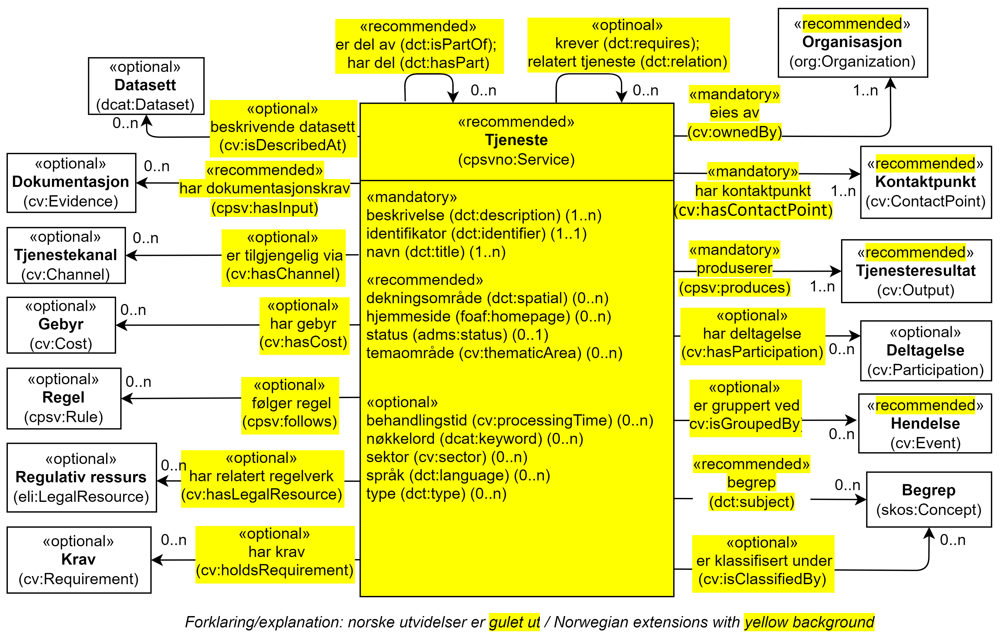

== Klassen Tjeneste (cpsvno:Service) [[Tjeneste]]

[[img-KlassenTjeneste]]
.Klassen Tjeneste (cpsvno:Service) og klassene den refererer til. 
[link=images/KlassenTjeneste.png]

[cols="30s,70d"]
|===
| _English name_ | _Service_
| Anvendelse / _Usage note_ | Klassen brukes til å beskrive en tjeneste.

_This class represents a Service._
| URI | cpsvno:Service
| Kravnivå / _Requirement level_ | Anbefalt / _Recommended_
| Merknad 1 / _Note 1_ | Bruk <<OffentligTjeneste>> når det er en offentlig tjeneste som skal beskrives.

_Use <<OffentligTjeneste>>  when the services to be described is a public service._
| Merknad 2 / _Note 2_ | Norsk utvidelse: Ikke eksplisitt spesifisert i CPSV-AP. Det er behov for å beskrive tjenester som ikke er en offentlig tjeneste. <<OffentligTjeneste>> som CPSV-AP har, blir en subklasse av denne.

_Norwegian extension: Not explicitly specified in CPSV-AP. It is needed in order to describe a service which is not a public service. The Public Service Class (`cpsv:PublicService`) that CPSV-AP has, is a subclass of this one._
| Eksempel | Se under <<OffentligTjeneste>> for eksempler på bruk av de tilsvarende egenskapene.
|===

[[Tjeneste-obligatoriske-egenskaper]]
=== Obligatoriske egenskaper for klassen _Tjeneste_

[[Tjeneste-beskrivelse]]
==== Tjeneste – beskrivelse (dct:description)

[cols="30s,70d"]
|===
| _English name_ | _description_
| URI | dct:description 
| Verdiområde / _Range_ | rdf:langString  
| Anvendelse / _Usage note_ | Egenskapen brukes til å oppgi en tekstlig beskrivelse av tjenesten. Egenskapen bør gjentas når beskrivelsen finnes på flere språk. 

_This property represents a free text Description of the Service. This property should be repeated when the text is in parallel languages._ 
| Multiplisitet / _Multiplicity_ | 1..n 
| Kravnivå / _Requirement level_ | Obligatorisk / _Mandatory_ 
| Merknad / _Note_ |  Norsk utvidelse: Ikke eksplisitt spesifisert i CPSV-AP.

_Norwegian extension: Not explicitly specified in CPSV-AP._
|===

[[Tjeneste-eiesAv]]
==== Tjeneste – eies av (cv:ownedBy)

[cols="30s,70d"]
|===
| _English name_ | _owned by_
| URI | cv:ownedBy 
| Verdiområde / _Range_ | org:Organization 
| Anvendelse / _Usage note_ | Egenskapen brukes til å referere til aktøren som eier tjenesten. 

_This property refers to the Agent who owns the Service._ 
| Multiplisitet / _Multiplicity_ | 1..n 
| Kravnivå / _Requirement level_ | Obligatorisk / _Mandatory_
| Merknad / _Note_ |  Norsk utvidelse: Ikke eksplisitt spesifisert i CPSV-AP.

_Norwegian extension: Not explicitly specified in CPSV-AP._
|===

[[Tjeneste-identifikator]]
==== Tjeneste – identifikator (dct:identifier)

[cols="30s,70d"]
|===
| _English name_ | _identifier_
| URI | dct:identifier 
| Verdiområde / _Range_ |rdfs:Literal 
| Anvendelse / _Usage note_ | Egenskapen brukes til å oppgi en formell identifikasjon til tjenesten. 

_This property represents a formally-issued Identifier for the Service._ 
| Multiplisitet / _Multiplicity_ | 1..1 
| Kravnivå / _Requirement level_ | Obligatorisk / _Mandatory_
| Merknad 1 / _Note 1_ | Identifikator er som regel systemgenerert av verktøystøtte, slik at du som vanlig bruker ikke trenger å fylle ut verdien til egenskapen manuelt.

For deg som skal utvikle/tilpasse verktøystøtte, se https://data.norge.no/guide/veileder-beskrivelse-av-datasett/#om-identifikator[Om identifikator (dct:identifier) i Veileder for beskrivelse av datasett osv. &#x29C9;, window="_blank", role="ext-link"]

__Identifier is usually generated by the application, such that you as an end-user of the application usually do not need to manually fill out the value of this property.__ 

__If you are developing applications, see https://data.norge.no/guide/veileder-beskrivelse-av-datasett/#om-identifikator[Om identifikator (dct:identifier) i Veileder for beskrivelse av datasett osv. &#x29C9;, window="_blank", role="ext-link"] (in Norwegian only).__
| Merknad 2 / _Note 2_ |  Norsk utvidelse: Ikke eksplisitt spesifisert i CPSV-AP.

_Norwegian extension: Not explicitly specified in CPSV-AP._
|===

[[Tjeneste-kontaktpunkt]]
==== Tjeneste – kontaktpunkt (cv:contactPoint)

[cols="30s,70d"]
|===
| _English name_ | _contact point_ 
| URI |   cv:contactPoint
| Verdiområde / _Range_ | cv:ContactPoint 
| Anvendelse / _Usage note_ | Egenskapen brukes til å oppgi kontaktpunkt(er) for tjenesten. 

_This property specifies contact points for the service._  
| Multiplisitet / _Multiplicity_ | 1..n 
| Kravnivå / _Requirement level_ | Obligatorisk / _Mandatory_ 
| Merknad / _Note_ |  Norsk utvidelse: Ikke eksplisitt spesifisert i CPSV-AP.

_Norwegian extension: Not explicitly specified in CPSV-AP._
|===

[[Tjeneste-navn]]
==== Tjeneste – navn (dct:title)

[cols="30s,70d"]
|===
| _English name_ | _name_
| URI | dct:title 
| Verdiområde / _Range_ | rdf:langString  
| Anvendelse / _Usage note_ | Egenskapen brukes til å oppgi det offisielle navnet på tjenesten. Egenskapen bør gjentas når navnet finnes på flere språk. 

_This property represents the official Name of the Service. This property should be repeated when the name is in parallel languages._
| Multiplisitet / _Multiplicity_ | 1..n 
| Kravnivå / _Requirement level_ | Obligatorisk / _Mandatory_ 
| Merknad / _Note_ |  Norsk utvidelse: Ikke eksplisitt spesifisert i CPSV-AP.

_Norwegian extension: Not explicitly specified in CPSV-AP._
|===

[[Tjeneste-produserer]]
==== Tjeneste – produserer (cpsv:produces)

[cols="30s,70d"]
|===
| _English name_ | _produces_ 
| URI | cpsv:produces 
| Verdiområde / _Range_ |cv:Output 
| Anvendelse / _Usage note_ | Egenskapen brukes til å referere til en eller flere instanser av tjenesteresultat (`cv:Output`) som beskriver resultatet av tjenesten.  

_This property links a Service to one or more instances of the Output class describing the actual result of executing a given Service._ 
| Multiplisitet / _Multiplicity_ | 1..n 
| Kravnivå / _Requirement level_ | Obligatorisk / _Mandatory_ 
| Merknad / _Note_ |  Norsk utvidelse: Ikke eksplisitt spesifisert i CPSV-AP.

_Norwegian extension: Not explicitly specified in CPSV-AP._
|===

[[Tjeneste-anbefalte-egenskaper]]
=== Anbefalte egenskaper for klassen _Tjeneste_

[[Tjeneste-begrep]]
==== Tjeneste – begrep (dct:subject)

[cols="30s,70d"]
|===
| _English name_ | _subject_
| URI | dct:subject
| Verdiområde/ _Range_ | skos:Concept
| Anvendelse / _Usage note_ | Egenskapen brukes til å referere til begrep som er viktig for å forstå tjenesten.

_This property refers to concept that is important for the understanding of the service._
| Multiplisitet / _Multiplicity_ | 0..n
| Kravnivå / _Requirement level_ |  Anbefalt / _Recommended_
| Merknad / _Note_ |  Norsk utvidelse: Ikke eksplisitt spesifisert i CPSV-AP.

_Norwegian extension: Not explicitly specified in CPSV-AP._
|===

[[Tjeneste-dekningsområde]]
==== Tjeneste – dekningsområde (dct:spatial)

[cols="30s,70d"]
|===
| _English name_ | _spatial coverage_ 
| URI | dct:spatial 
| Verdiområde / _Range_ |dct:Location 
| Anvendelse / _Usage note_ | Egenskapen brukes til å referere til et geografisk område som dekkes av tjenesten. 

_This property represents a given area within which a Service is likely to be available._ 
| Multiplisitet / _Multiplicity_ | 0..n 
| Kravnivå / _Requirement level_ | Anbefalt / _Recommended_ 
| Merknad 1 / _Note 1_ a|Følgende krav til bruk av kontrollerte vokabularer gjelder:

* Minst en verdi skal være fra en av følgende kontrollerte vokabularer: https://op.europa.eu/en/web/eu-vocabularies/concept-scheme/-/resource?uri=http://publications.europa.eu/resource/authority/continent[Kontinent &#x29C9;, window="_blank", role="ext-link"]; https://op.europa.eu/en/web/eu-vocabularies/concept-scheme/-/resource?uri=http://publications.europa.eu/resource/authority/country[Land &#x29C9;, window="_blank", role="ext-link"]; https://op.europa.eu/en/web/eu-vocabularies/concept-scheme/-/resource?uri=http://publications.europa.eu/resource/authority/place[Sted &#x29C9;, window="_blank", role="ext-link"].

* For å angi dekningsområde i Norge, bør Kartverkets kontrollerte vokabular https://data.geonorge.no/administrativeEnheter/nasjon/doc/173163[Administrative enheter &#x29C9;, window="_blank", role="ext-link"] brukes.

_Regarding usage of controlled vocabularies, the following requirements apply:_

* __At least one value shall be chosen from the following controlled vocabularies: https://op.europa.eu/en/web/eu-vocabularies/concept-scheme/-/resource?uri=http://publications.europa.eu/resource/authority/continent[Continent &#x29C9;, window="_blank", role="ext-link"]; https://op.europa.eu/en/web/eu-vocabularies/concept-scheme/-/resource?uri=http://publications.europa.eu/resource/authority/country[Country &#x29C9;, window="_blank", role="ext-link"]; https://op.europa.eu/en/web/eu-vocabularies/concept-scheme/-/resource?uri=http://publications.europa.eu/resource/authority/place[Place &#x29C9;, window="_blank", role="ext-link"].__

* __To specify spatial coverage in Norway, the Norwegian Mapping Authority's controlled vocabulary https://data.geonorge.no/administrativeEnheter/nasjon/doc/173163[Administrative units &#x29C9;, window="_blank", role="ext-link"] should be used.__
| Merknad 2 / _Note 2_ |  Norsk utvidelse: Ikke eksplisitt spesifisert i CPSV-AP.

_Norwegian extension: Not explicitly specified in CPSV-AP._
|===

[[Tjeneste-erDelAv]]
==== Tjeneste – er del av (dct:isPartOf)

[cols="30s,70d"]
|===
| _English name_ | _is part of_ 
| URI | dct:isPartOf 
| Verdiområde / _Range_ |cpsvno:Service 
| Anvendelse / _Usage note_ | Egenskapen brukes til å referere til en annen tjeneste som tjenesten er en del av. 

_This property indicates a related Service in which is included. This property is the inverse of `dct:hasPart`._ 
| Multiplisitet / _Multiplicity_ | 0..n 
| Kravnivå / _Requirement level_ | Anbefalt / _Recommended_ 
| Merknad 1 / _Note 1_ | Denne er den inverse av egenskapen <<Tjeneste-harDel>>.

_This is the inverse of the property <<Tjeneste-harDel>>._
| Merknad 2 / _Note 2_ |  Norsk utvidelse: Ikke eksplisitt spesifisert i CPSV-AP.

_Norwegian extension: Not explicitly specified in CPSV-AP._
|===

[[Tjeneste-harDel]]
==== Tjeneste – har del (dct:hasPart)

[cols="30s,70d"]
|===
| _English name_ | _has part_ 
| URI | dct:hasPart 
| Verdiområde / _Range_ | cpsvno:Service 
| Anvendelse / _Usage note_ | Egenskapen brukes til å referere til en tjeneste som er inkludert enten fysisk eller logisk i tjenesten som beskrives. 

_This property indicates a related Service that is included either physically or logically in the described resource._  
| Multiplisitet / _Multiplicity_ | 0..n 
| Kravnivå / _Requirement level_ | Anbefalt / _Recommended_ 
| Merknad 1 / _Note 1_ | Dette er den inverse av egenskapen <<Tjeneste-harDel>>. 

_This is the inverse of the property <<Tjeneste-harDel>>._
| Merknad 2 / _Note 2_ |  Norsk utvidelse: Ikke eksplisitt spesifisert i CPSV-AP.

_Norwegian extension: Not explicitly specified in CPSV-AP._
|===

[[Tjeneste-har-dokumentasjonskrav]]
==== Tjeneste – har dokumentasjonskrav (cpsv:hasInput)

[cols="30s,70d"]
|===
| _English name_ | _has input_ 
| URI | cpsv:hasInput 
| Verdiområde / _Range_ |cv:Evidence 
| Anvendelse / _Usage note_ | Egenskapen brukes til å referere til en eller flere instanser av klassen Dokumentasjon (`cv:Evidence`), som kreves av tjenesten.  

_This property links a Service to one or more instances of the Evidence class._ 
| Multiplisitet / _Multiplicity_ | 0..n 
| Kravnivå / _Requirement level_ |  Anbefalt / _Recommended_ 
| Merknad 1 / _Note 1_ | For å kunne levere en tjeneste kan det kreves  dokumentasjon. Hvis dokumentasjon som kreves varierer avhengig av kanal tjenesten tilbys gjennom, kan tilsvarende egenskap i klassen Tjenestekanal benyttes.  

_A specific Service may require the presence of certain pieces of Evidence in order to be delivered. If the evidence required to make use of a service varies according to the channel through which it is accessed, then Has Input should be at the level of the Channel._
| Merknad 2 / _Note 2_ |  Norsk utvidelse: Ikke eksplisitt spesifisert i CPSV-AP.

_Norwegian extension: Not explicitly specified in CPSV-AP._  
|===

[[Tjeneste-hjemmeside]]
==== Tjeneste – hjemmeside (foaf:homepage)

[cols="30s,70d"]
|===
| _English name_ | _homepage_ 
| URI | foaf:homepage 
| Verdiområde / _Range_ |foaf:Document 
| Anvendelse / _Usage note_ | Egenskapen brukes til å referere til hjemmesiden til tjenesten.   

_This property refers to the homepage of a Service._ 
| Multiplisitet / _Multiplicity_ | 0..n 
| Kravnivå / _Requirement level_ | Anbefalt / _Recommended_ 
| Merknad / _Note_ |  Norsk utvidelse: Ikke eksplisitt spesifisert i CPSV-AP.

_Norwegian extension: Not explicitly specified in CPSV-AP._
|===

[[Tjeneste-status]]
==== Tjeneste – status (adms:status)

[cols="30s,70d"]
|===
| _English name_ | _status_ 
| URI | adms:status 
| Verdiområde / _Range_ |skos:Concept 
| Anvendelse / _Usage note_ | Egenskapen brukes til å referere til status til tjenesten (f.eks. aktiv, inaktiv, under utvikling osv.) i henhold til et predefinert kontrollert vokabular. 

_This property indicates whether a Service is active, inactive, under development etc. according to a controlled vocabulary._ 
| Multiplisitet / _Multiplicity_ | 0..1 
| Kravnivå / _Requirement level_ | Anbefalt / _Recommended_ 
| Merknad 1 / _Note 1_ | Verdien skal velges fra http://purl.org/adms/status/[ADMS Status Vocabulary (lenket ressurs i RDF) &#x29C9;, window="_blank", role="ext-link"] (samme krav som i DCAT-AP-NO som er basert på EUs BRegDCAT-AP). 

__The value shall be chosen from http://purl.org/adms/status/[ADMS Status Vocabulary (linked resource in RDF) &#x29C9;, window="_blank", role="ext-link"].__
| Merknad 2 / _Note 2_ |  Norsk utvidelse: Ikke eksplisitt spesifisert i CPSV-AP.

_Norwegian extension: Not explicitly specified in CPSV-AP._
|===

[[Tjeneste-temaområde]]
==== Tjeneste – temaområde (cv:thematicArea)

[cols="30s,70d"]
|===
| _English name_ | _thematic area_ 
| URI | cv:thematicArea 
| Verdiområde / _Range_ |skos:Concept 
| Anvendelse / _Usage note_ | Egenskapen brukes til å referere til primært temaområde som dekkes av tjenesten. 

_This property represents the Thematic Area of a Service as described in a controlled vocabulary._ 
| Multiplisitet / _Multiplicity_ | 0..n 
| Kravnivå / _Requirement level_ | Anbefalt / _Recommended_ 
| Merknad 1 / _Note 1_ | Verdien bør velges fra EUs kontrollerte vokabular https://op.europa.eu/en/web/eu-vocabularies/concept-scheme/-/resource?uri=http://eurovoc.europa.eu/100141[EuroVoc &#x29C9;, window="_blank", role="ext-link"] eller https://psi.norge.no/los/[Los – felles vokabular for å kategorisere og beskrive offentlige tjenester og ressurser &#x29C9;, window="_blank", role="ext-link"].

__The value should be chosen from EU's controlled vocabulary https://op.europa.eu/en/web/eu-vocabularies/concept-scheme/-/resource?uri=http://eurovoc.europa.eu/100141[EuroVoc &#x29C9;, window="_blank", role="ext-link"] or https://psi.norge.no/los/[Los &#x29C9;, window="_blank", role="ext-link"].__
| Merknad 2 / _Note 2_ |  Norsk utvidelse: Ikke eksplisitt spesifisert i CPSV-AP.

_Norwegian extension: Not explicitly specified in CPSV-AP._
|===

[[Tjeneste-valgfrie-egenskaper]]
=== Valgfrie egenskaper for klassen _Tjeneste_

[[Tjeneste-behandlingstid]]
==== Tjeneste – behandlingstid (cv:processingTime)

[cols="30s,70d"]
|===
| _English name_ | _processing time_ 
| URI | cv:processingTime 
| Verdiområde / _Range_ | xsd:duration 
| Anvendelse / _Usage note_ | Egenskapen brukes til å oppgi den estimerte behandlingstiden. 

_The value of this property is the (estimated) time needed for executing a Service._ 
| Multiplisitet / _Multiplicity_ | 0..1 
| Kravnivå / _Requirement level_ | Valgfri / _Optional_ 
| Merknad 1 / _Note 1_ | Opplysningen skal oppgis ved hjelp av ISO 8601-syntaksen for varighet. Forklaring er gitt på https://en.wikipedia.org/wiki/ISO_8601#Durations[Wikipedia-siden &#x29C9;, window="_blank", role="ext-link"] som refererer til den offisielle ISO-standarden.

__The actual information is provided using the ISO 8601 syntax for durations. Explanation is provided in the https://en.wikipedia.org/wiki/ISO_8601#Durations[Wikipedia page &#x29C9;, window="_blank", role="ext-link"] that references the official ISO standard.__
| Merknad 2 / _Note 2_ |  Norsk utvidelse: Ikke eksplisitt spesifisert i CPSV-AP.

_Norwegian extension: Not explicitly specified in CPSV-AP._
|===

[[Tjeneste-beskrivendeDatasett]]
==== Tjeneste – beskrivende datasett (cv:isDescribedAt)

[cols="30s,70d"]
|===
| _English name_ | _is described at_ 
| URI | cv:isDescribedAt 
| Verdiområde / _Range_ |dcat:Dataset 
| Anvendelse / _Usage note_ | Egenskapen brukes til å referere til datasett som beskriver tjenesten.  

_This property links a Service to the Dataset(s) in which it is being described._ 
| Multiplisitet / _Multiplicity_ | 0..n 
| Kravnivå / _Requirement level_ | Valgfri / _Optional_ 
| Merknad 1 / _Note 1_ | Bruk egenskapen <<Tjeneste-har-dokumentasjonskrav>> for å kytte til datasett som tjenesten bruker, eller egenskapen <<Tjeneste-produserer>> for datasett som tjenesten produserer.  

_Use the property <<Tjeneste-har-dokumentasjonskrav>> to refer to dataset that the service uses, or the property <<Tjeneste-produserer>> to refer to dataset that the service produces._
| Merknad 2 / _Note 2_ |  Norsk utvidelse: Ikke eksplisitt spesifisert i CPSV-AP.

_Norwegian extension: Not explicitly specified in CPSV-AP._
|===

[[Tjeneste-erGruppertVed]]
==== Tjeneste – er gruppert ved (cv:isGroupedBy)

[cols="30s,70d"]
|===
| _English name_ | _is grouped by_
| URI | cv:isGroupedBy
| Verdiområde/ _Range_ | cv:Event
| Anvendelse / _Usage note_ | Egenskapen brukes til å referere til en eller flere hendelser som utløser behov for tjenesten.

_This property links the Service to the triggering Event class._
| Multiplisitet / _Multiplicity_ | 0..n
| Kravnivå / _Requirement level_ | Valgfri / _Optional_
| Merknad / _Note_ |  Norsk utvidelse: Ikke eksplisitt spesifisert i CPSV-AP.

_Norwegian extension: Not explicitly specified in CPSV-AP._
|===

[[Tjeneste-erKlassifisertUnder]]
==== Tjeneste – er klassifisert under (cv:isClassifiedBy)

[cols="30s,70d"]
|===
| _English name_ | _is classified by_ 
| URI | cv:isClassifiedBy 
| Verdiområde / _Range_ |skos:Concept 
| Anvendelse / _Usage note_ | Egenskapen brukes til å referere til et eller flere begreper som er brukt til å klassifisere tjenesten, begreper som _ikke_ er eller _ikke_ kan være inkludert i andre egenskaper som <<Tjeneste-temaområde>>, <<Tjeneste-sektor>> osv. 

_This property allows to classify the Service with any Concept, other than those already foreseen and defined explicitly in the <<Tjeneste-temaområde>>, <<Tjeneste-sektor>> etc._ 
| Multiplisitet / _Multiplicity_ | 0..n 
| Kravnivå / _Requirement level_ | Valgfri / _Optional_ 
| Merknad / _Note_ |  Norsk utvidelse: Ikke eksplisitt spesifisert i CPSV-AP.

_Norwegian extension: Not explicitly specified in CPSV-AP._
|===

[[Tjeneste-erTilgjengeligVia]]
==== Tjeneste – er tilgjengelig via (cv:hasChannel)

[cols="30s,70d"]
|===
| _English name_ | _has channel_ 
| URI | cv:hasChannel 
| Verdiområde / _Range_ |cv:Channel 
| Anvendelse / _Usage note_ | Egenskapen brukes til å referere til en eller flere kanaler som tjenesten er tilgjengelig gjennom, f.eks. gjennom online, telefonisk eller fysisk oppmøte. 

_This property links the Service to any Channel through which an Agent provides, uses or otherwise interacts with the Service, such as an online service, phone number or office._  
| Multiplisitet / _Multiplicity_ | 0..n 
| Kravnivå / _Requirement level_ | Valgfri / _Optional_ 
| Merknad / _Note_ |  Norsk utvidelse: Ikke eksplisitt spesifisert i CPSV-AP.

_Norwegian extension: Not explicitly specified in CPSV-AP._
|===

[[Tjeneste-følgerRegel]]
==== Tjeneste – følger regel (cpsv:follows)

[cols="30s,70d"]
|===
| _English name_ | _follows_ 
| URI | cpsv:follows 
| Verdiområde / _Range_ |cpsv:Rule 
| Anvendelse / _Usage note_ | Egenskapen brukes til å referere til regelen som gjelder for tjenesten. 

_This property links a Service to the Rule(s) under which it operates._ 
| Multiplisitet / _Multiplicity_ | 0..n 
| Kravnivå / _Requirement level_ | Valgfri / _Optional_ 
| Merknad / _Note_ |  Norsk utvidelse: Ikke eksplisitt spesifisert i CPSV-AP.

_Norwegian extension: Not explicitly specified in CPSV-AP._
|Eksempel |Se også <<KnytteTilRegelverk>>. 
|===

[[Tjeneste-har-deltagelse]]
==== Tjeneste – har deltagelse (cv:hasParticipation)

[cols="30s,70d"]
|===
| _English name_ | _has participation_ 
| URI | cv:hasParticipation 
| Verdiområde / _Range_ |cv:Participation 
| Anvendelse / _Usage note_ | Egenskapen brukes til å knytte til andre aktører som deltar i eller samhandler med tjenesten.  

_The CPSV-AP defines the two basic roles of Competent Authority and Service Provider, but this simple model can be extended if required using this property that links to the Participation class._ 
| Multiplisitet / _Multiplicity_ | 0..n 
| Kravnivå / _Requirement level_ | Valgfri / _Optional_ 
| Merknad / _Note_ |  Norsk utvidelse: Ikke eksplisitt spesifisert i CPSV-AP.

_Norwegian extension: Not explicitly specified in CPSV-AP._
|===

==== Tjeneste – har dokumentasjonstype (cv:hasInputType) [[Tjeneste-har-dokumentasjonstype]]

[cols="30s,70d"]
|===
| _English name_ | _has input type_
| URI | cv:hasInputType
| Verdiområde/ _Range_ | cv:EvidenceType
| Anvendelse / _Usage note_ | Egenskapen brukes til å knytte til tjenesten en eller flere dokumentasjonstyper.

_It links a Service to one or more instances of the EvidenceType class._
| Multiplisitet / _Multiplicity_ | 0..n
| Kravnivå / _Requirement level_ |  Valgfri / _Optional_
|===

==== Tjeneste – har gebyr (cv:hasCost) [[Tjeneste-har-gebyr]]

[cols="30s,70d"]
|===
| _English name_ | _has cost_ 
| URI | cv:hasCost 
| Verdiområde / _Range_ |cv:Cost 
| Anvendelse / _Usage note_ | Egenskapen brukes til å referere til en eller flere instanser av klassen Gebyr (cv:Cost), for å oppgi ev. gebyr for tjenesten.  

_This property links a Service to one or more instances of the Cost class. It indicates the costs related to the execution of a Service for the citizen or business related to the execution of the particular Service._ 
| Multiplisitet / _Multiplicity_ | 0..n 
| Kravnivå / _Requirement level_ | Valgfri / _Optional_ 
| Merknad 1 / _Note 1_ |  Der gebyret varierer avhengig av kanalen tjenesten tilbys gjennom, skal egenskapen <<Gebyr-hvisTilbysGjennom>> brukes.

_Where the cost varies depending on the channel through which the service is accessed, it can be linked to the channel using the <<Gebyr-hvisTilbysGjennom>> relationship._ 
| Merknad 2 / _Note 2_ |  Norsk utvidelse: Ikke eksplisitt spesifisert i CPSV-AP.

_Norwegian extension: Not explicitly specified in CPSV-AP._
|===

[[Tjeneste-har-krav]]
==== Tjeneste – har krav (cv:holdsRequirement)

[cols="30s,70d"]
|===
| _English name_ |  _holds requirement_
| URI |  cv:holdsRequirement 
| Verdiområde / _Range_ | cv:Requirement 
| Anvendelse / _Usage note_ | Egenskapen brukes til å referere til krav knyttet til behov for eller bruk av tjenesten.   

_This property links a Service to a class that describes the criteria for needing or using the service, such as residency in a given location, being over a certain age etc._
| Multiplisitet / _Multiplicity_ | 0..n 
| Kravnivå / _Requirement level_ | Valgfri / _Optional_ 
| Merknad / _Note_ |  Norsk utvidelse: Ikke eksplisitt spesifisert i CPSV-AP.

_Norwegian extension: Not explicitly specified in CPSV-AP._
|===

[[Tjeneste-har-relatert-regelverk]]
==== Tjeneste – har relatert regelverk (cv:hasLegalResource)

[cols="30s,70d"]
|===
| _English name_ | _has legal resource_ 
| URI | cv:hasLegalResource 
| Verdiområde / _Range_ |eli:LegalResource 
| Anvendelse / _Usage note_ | Egenskapen brukes til å referere til regelverk (instans av "regulativ ressurs") som tjenesten opereres under eller har som sin juridiske ramme, eller på andre måter er relatert til. 

_This property links a Service to a Legal Resource. It indicates the Legal Resource (e.g. legislation) to which the Service relates, operates or has its legal basis._ 
| Multiplisitet / _Multiplicity_ | 0..n 
| Kravnivå / _Requirement level_ | Valgfri / _Optional_ 
| Merknad / _Note_ |  Norsk utvidelse: Ikke eksplisitt spesifisert i CPSV-AP.

_Norwegian extension: Not explicitly specified in CPSV-AP._
|===

[[Tjeneste-krever]]
==== Tjeneste – krever (dct:requires)

[cols="30s,70d"]
|===
| _English name_ | _requires_ 
| URI | dct:requires 
| Verdiområde / _Range_ |cpsvno:Service
| Anvendelse / _Usage note_ | Egenskapen brukes til å referere til en eller flere andre tjenester som tjenesten krever utført først, eller som tjenesten på en eller annen måte bruker resultatet fra.  

_One Service may require, or in some way make use of, the output of one or several other Services. In this case, for a Service to be executed, another Service must be executed beforehand. The nature of the requirement will be described in the associated Rule or Input._ 
| Multiplisitet / _Multiplicity_ | 0..n 
| Kravnivå / _Requirement level_ | Valgfri / _Optional_ 
| Merknad / _Note_ |  Norsk utvidelse: Ikke eksplisitt spesifisert i CPSV-AP.

_Norwegian extension: Not explicitly specified in CPSV-AP._
|===

==== Tjeneste – målgruppe (dct:audience) [[Tjeneste-målgruppe]]

[cols="30s,70d"]
|===
| _English name_ | _addressee_ 
| URI | dct:audience 
| Verdiområde / _Range_ | skos:Concept
| Anvendelse / _Usage note_ | Egenskapen brukes til å spesifisere målgruppe av tjenesten.   

_This property is used to specify the target recipient of the service._ 
| Multiplisitet / _Multiplicity_ | 0..n 
| Kravnivå / _Requirement level_ | Valgfri / _Optional_ 
| Merknad / _Note_ | Norsk utvidelse: Ikke eksplisitt spesifisert i CPSV-AP.

_Norwegian extension: Not explicitly specified in CPSV-AP._
|===

[[Tjeneste-nøkkelord]]
==== Tjeneste – nøkkelord (dcat:keyword)

[cols="30s,70d"]
|===
| _English name_ | _keyword_ 
| URI | dcat:keyword 
| Verdiområde / _Range_ | rdf:langString  
| Anvendelse / _Usage note_ | Egenskapen brukes til å oppgi nøkkelord som beskriver den aktuelle tjenesten. 

_This property represents a keyword, term or phrase to describe the Service._ 
| Multiplisitet / _Multiplicity_ | 0..n 
| Kravnivå / _Requirement level_ | Valgfri / _Optional_ 
| Merknad / _Note_ |  Norsk utvidelse: Ikke eksplisitt spesifisert i CPSV-AP.

_Norwegian extension: Not explicitly specified in CPSV-AP._
|===

[[Tjeneste-relatertTjeneste]]
==== Tjeneste – relatert tjeneste (dct:relation)

[cols="30s,70d"]
|===
| _English name_ | _related service_
| URI | dct:relation 
| Verdiområde / _Range_ |cpsvno:Service 
| Anvendelse / _Usage note_ | Egenskapen brukes til å referere til en eller flere andre relaterte tjenester.  

_This property represents a Service related to the particular instance of the Service class._ 
| Multiplisitet / _Multiplicity_ | 0..n 
| Kravnivå / _Requirement level_ | Valgfri / _Optional_ 
| Merknad 1 / _Note 1_ | Bruk heller egenskapen <<Tjeneste-krever>> der det er avhengighet mellom tjenestene. 

_Use rather the property <<Tjeneste-krever>> where there is a dependency between the services._
| Merknad 2 / _Note 2_ |  Norsk utvidelse: Ikke eksplisitt spesifisert i CPSV-AP.

_Norwegian extension: Not explicitly specified in CPSV-AP._
|===

[[Tjeneste-sektor]]
==== Tjeneste – sektor (cv:sector)

[cols="30s,70d"]
|===
| _English name_ | _sector_ 
| URI | cv:sector 
| Verdiområde / _Range_ |skos:Concept 
| Anvendelse / _Usage note_ | Egenskapen brukes til å referere til industri/sektor som den aktuelle tjenesten er relatert til, eller er ment for. En tjeneste kan relateres til flere industrier/sektorer.  

_This property represents the industry or sector a Service relates to, or is intended for. Note that a single Service may relate to multiple sectors._ 
| Multiplisitet / _Multiplicity_ | 0..n 
| Kravnivå / _Requirement level_ | Valgfri / _Optional_ 
| Merknad 1 / _Note 1_ |De mulige verdiene for egenskapen er beskrevet i EUs kontrollerte vokabular https://op.europa.eu/en/web/eu-vocabularies/concept-scheme/-/resource?uri=http://publications.europa.eu/resource/authority/data-theme[Data theme &#x29C9;, window="_blank", role="ext-link"].

__The possible values for this property are described in the controlled vocabulary https://op.europa.eu/en/web/eu-vocabularies/concept-scheme/-/resource?uri=http://publications.europa.eu/resource/authority/data-theme[Data theme &#x29C9;, window="_blank", role="ext-link"] of the Publications Office.__
| Merknad 2 / _Note 2_ |  Norsk utvidelse: Ikke eksplisitt spesifisert i CPSV-AP.

_Norwegian extension: Not explicitly specified in CPSV-AP._
|===

[[Tjeneste-språk]]
==== Tjeneste – språk (dct:language)

[cols="30s,70d"]
|===
| _English name_ | _language_ 
| URI | dct:language 
| Verdiområde / _Range_ |dct:LinguisticSystem 
| Anvendelse / _Usage note_ | Egenskapen brukes til å oppgi hvilke språk tjenesten er tilgjengelig på. Dette kan være ett språk eller flere språk, for eksempel i land med mer enn ett offisielt språk. 

_This property represents the language(s) in which the Service is available. This could be one language or multiple languages, for instance in countries with more than one official language._ 
| Multiplisitet / _Multiplicity_ | 0..n 
| Kravnivå / _Requirement level_ | Valgfri / _Optional_ 
| Merknad 1 / _Note 1_ |Verdien skal velges fra EUs kontrollerte vokabular https://op.europa.eu/en/web/eu-vocabularies/concept-scheme/-/resource?uri=http://publications.europa.eu/resource/authority/language[Språk &#x29C9;, window="_blank", role="ext-link"].

__The value shall be chosen from Eu's controlled vocabulary https://op.europa.eu/en/web/eu-vocabularies/concept-scheme/-/resource?uri=http://publications.europa.eu/resource/authority/language[Language &#x29C9;, window="_blank", role="ext-link"].__
| Merknad 2 / _Note 2_ |  Norsk utvidelse: Ikke eksplisitt spesifisert i CPSV-AP.

_Norwegian extension: Not explicitly specified in CPSV-AP._
|===

[[Tjeneste-type]]
==== Tjeneste – type (dct:type)

[cols="30s,70d"]
|===
| _English name_ | _type_ 
| URI | dct:type 
| Verdiområde / _Range_ |skos:Concept 
| Anvendelse / _Usage note_ | Egenskapen brukes til å indikere type tjeneste i henhold til et kontrollert vokabular. 

_This property represents the Type of a Service as described in a controlled vocabulary._ 
| Multiplisitet / _Multiplicity_ | 0..n 
| Kravnivå / _Requirement level_ |  Valgfri / _Optional_ 
| Merknad 1 / _Note 1_ |Verdien bør velges fra et kontrollert vokabular.

_The value should be chosen from a controlled vocabulary._
| Merknad 2 / _Note 2_ |  Norsk utvidelse: Ikke eksplisitt spesifisert i CPSV-AP.

_Norwegian extension: Not explicitly specified in CPSV-AP._
|===
