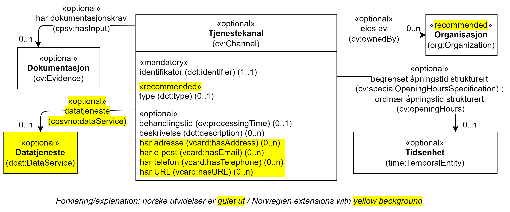

== Klassen Tjenestekanal (cv:Channel) [[Tjenestekanal]]

[[img-KlassenTjenestekanal]]
.Klassen Tjenestekanal (cv:Channel) og klassene den refererer til. 
[link=images/KlassenTjenestekanal.png]

[cols="30s,70d"]
|===
| _English name_ | _Channel_
| Anvendelse / _Usage note_ |  Klassen brukes til å representere kanal/medium som tjenesten er tilgjengelig gjennom.

_The Channel class represents the medium through which an Agent provides, uses or interacts in another way with a Service. Typical examples include online services, phone, walk-in centres etc._
| URI | cv:Channel
| Kravnivå / _Requirement level_ | Valgfri / _Optional_ 
|===

=== Obligatoriske egenskaper for klassen _Tjenestekanal_ [[Tjenestekanal-obligatoriske-egenskaper]]

==== Tjenestekanal – identifikator (dct:identifier) [[Tjenestekanal-identifikator]]

[cols="30s,70d"]
|===
| _English name_ | _identifier_
| URI | dct:identifier
| Verdiområde / _Range_ | rdfs:Literal
| Anvendelse / _Usage note_ |  Egenskapen brukes  til å oppgi identifikatoren til tjenestekanalen.

_This property represents an Identifier for the Channel._
| Multiplisitet / _Multiplicity_ | 1..1
| Kravnivå / _Requirement level_ | Obligatorisk / _Mandatory_
| Merknad / _Note_ | Identifikator er som regel systemgenerert av verktøystøtte, slik at du som vanlig bruker ikke trenger å fylle ut verdien til egenskapen manuelt.

For deg som skal utvikle/tilpasse verktøystøtte, se https://data.norge.no/guide/veileder-beskrivelse-av-datasett/#om-identifikator[Om identifikator (dct:identifier) i Veileder for beskrivelse av datasett osv.]

_Identifier is usually generated by the application, such that you as an end-user of the application usually do not need to manually fill out the value of this property._ 

_If you are developing applications, see https://data.norge.no/guide/veileder-beskrivelse-av-datasett/#om-identifikator[Om identifikator (dct:identifier) i Veileder for beskrivelse av datasett osv.] (in Norwegian only)._
|===

=== Anbefalte egenskaper for klassen _Tjenestekanal_ [[Tjenestekanal-anbefalte-egenskaper]]

==== Tjenestekanal – type (dct:type) [[Tjenestekanal-type]]

[cols="30s,70d"]
|===
| _English name_ | _type_
| URI | dct:type
| Verdiområde / _Range_ | skos:Concept
| Anvendelse / _Usage note_ |  Egenskapen brukes  til å oppgi type kanal.

_This property represents the type of Channel as defined in a controlled vocabulary._
| Multiplisitet / _Multiplicity_ | 0..1
| Kravnivå / _Requirement level_ |  Anbefalt / _Recommended_
| Merknad / _Note_ | Verdien skal velges fra det felles kontrollerte vokabularet https://data.norge.no/vocabulary/service-channel-type[Tjenestekanaltype], når verdien finnes i vokabularet.

_The value shall be chosen from the common controlled vocabulary https://data.norge.no/vocabulary/service-channel-type[Service channel type], when the value is in the vocabulary._
| Eksempel | Online
|===

Eksempel i RDF Turtle:
-----
<viaSkjemaportalen> a cv:Channel ;
   vcard:hasURL "https://kommune24-7.no/1813" ;
   dct:type <https://data.norge.no/vocabulary/service-channel-type#online> ; .
-----

=== Valgfrie egenskaper for klassen _Tjenestekanal_ [[Tjenestekanal-valgfrie-egenskaper]]

==== Tjenestekanal – begrenset åpningstid strukturert (cv:specialOpeningHoursSpecification) [[Tjenestekanal-begrenset-åpningstid-strukturert]]

[cols="30s,70d"]
|===
| _English name_ |  _availability restriction_
| URI |  cv:specialOpeningHoursSpecification
| Verdiområde / _Range_ |  time:TemporalEntity
| Anvendelse / _Usage note_ |  Egenskapen brukes  til å oppgi begrenset åpningstid, som strukturert data.

_This property links a channel to information about when the channel is not available._
| Multiplisitet / _Multiplicity_ | 0..n
| Kravnivå / _Requirement level_ | Valgfri / _Optional_ 
| Eksempel | Se eksempler under <<Tidsenhet>>.
|===

Eksempel i RDF Turtle: Se under <<Tidsenhet>>.

==== Tjenestekanal – behandlingstid (cv:processingTime) [[Tjenestekanal-behandlingstid]]

[cols="30s,70d"]
|===
| _English name_ | _processing time_ 
| URI | cv:processingTime 
| Verdiområde / _Range_ |  xsd:duration 
| Anvendelse / _Usage note_ | Egenskapen brukes  til å oppgi den estimerte behandlingstiden via kanalen. 

_The value of this property is the (estimated) time needed for executing a Service through this canal._
| Multiplisitet / _Multiplicity_ | 0..1 
| Kravnivå  / _Requirement level_ | Valgfri / _Optional_  
| Merknad 1 / _Note 1_ |  Egenskapen brukes bare hvis behandlingstiden er spesifikk for den valgte kanalen.

_This property is used only if the processing time is specific for the channel chosen._ 
| Merknad 2 / _Note 2_ |  Opplysningen skal oppgis ved hjelp av ISO 8601-syntaksen for varighet. Forklaring er gitt på https://en.wikipedia.org/wiki/ISO_8601#Durations[Wikipedia-siden] som refererer til den offisielle ISO-standarden.

_The actual information is provided using the ISO 8601 syntax for durations. Explanation is provided in the https://en.wikipedia.org/wiki/ISO_8601#Durations[Wikipedia page] that references the official ISO standard._
|===

==== Tjenestekanal – beskrivelse (dct:description) [[Tjenestekanal-beskrivelse]]

[cols="30s,70d"]
|===
| _English name_ |  _descriptoion_
| URI |  dct:description 
| Verdiområde / _Range_ |  rdf:langString
| Anvendelse / _Usage note_ | Egenskapen brukes  til å oppgi beskrivelsen av kanalen. Egenskapen bør gjentas når beskrivelsen finnes på flere språk.  

_This property represents the description of the canal, repeated when the description is in parallel languages._
| Multiplisitet / _Multiplicity_ | 0..n
| Kravnivå  / _Requirement level_ | Valgfri / _Optional_  
|===

==== Tjenestekanal – datatjeneste (cpsvno:dataService) [[Tjenestekanal-datatjeneste]]

[cols="30s,70d"]
|===
| _English name_ | _data service_
| URI | cpsvno:dataService
| Verdiområde / _Range_ | dcat:DataService
| Anvendelse / _Usage note_ |  Egenskapen brukes  til å referere til en beskrivelse av en datatjeneste som kanalen benytter.

_This property refers to the description of a data service which the channel uses._
| Multiplisitet / _Multiplicity_ | 0..n 
| Kravnivå / _Requirement level_ | Valgfri / _Optional_
| Merknad / _Note_ | Norsk utvidelse: Finnes ikke eksplisitt i CPSV-AP. Det er behov for å knytte kanalen til en datatjenestebeskrivelse.

_Norwegian extension: Not explicitly specified in CPSV-AP._
| Eksempel |  https://altinn.github.io/docs/tul/tjenestetyper/innsending/[Altinns innsendingstjenester]
|===

==== Tjenestekanal – eies av (cv:ownedBy) [[Tjenestekanal-eiesAv]]

[cols="30s,70d"]
|===
| _English name_ | _owned by_
| URI | cv:ownedBy
| Verdiområde / _Range_ |  org:Organization
| Anvendelse / _Usage note_ |  Egenskapen brukes  til å referere til organisasjonen som eier tjenestekanalen.

_This property indicates the owner of a specific Channel through which a Service is being delivered._
| Multiplisitet / _Multiplicity_ | 0..n
| Kravnivå / _Requirement level_ | Valgfri / _Optional_ 
| Eksempel |  Tjenestekanaler for tjenesten «Skjenkebevilling i Brønnøy kommune» eies av Brønnøy kommune.
|===

Eksempel i RDF Turtle:
-----
<viaSkjemaportalen> a cv:Channel ;
   vcard:hasURL "https://kommune24-7.no/1813" ;
   cv:ownedBy "https://organization-catalog.fellesdatakatalog.digdir.no/organizations/991825827" ; .
-----

==== Tjenestekanal – har adresse (vcard:hasAddress) [[Tjenestekanal-harAdresse]]

[cols="30s,70d"]
|===
| _English name_ | _has address_
| URI | vcard:hasAddress
| Verdiområde / _Range_ | vcard:Address
| Anvendelse / _Usage note_ |  Egenskapen brukes  til å oppgi adressen som strukturert data, når tjenestekanalen er et fysisk oppmøtested.

_This property specifies the address as structured data, when the channel is a service bureau or location._
| Multiplisitet / _Multiplicity_ | 0..n
| Kravnivå / _Requirement level_ | Valgfri / _Optional_ 
| Merknad / _Note_ | Norsk utvidelse: Finnes ikke eksplisitt i CPSV-AP. Det er behov for å oppgi adressen når tjenestekanalen er et fysisk oppmøtested.

_Norwegian extension: Not explicitly specified in CPSV-AP._
| Eksempel | Besøksadressen til Brønnøy kommune.
|===

Eksempel i RDF Turtle:
-----
<personligOppmøte> a cv:Channel ;
   vcard:hasAddress [ a vcard:Address ;
      vcard:street-address "Sivert Nielsens gt. 24" ;
      vcard:locality "Brønnøysund" ;
      vcard:postal-code "8905" ;
      vcard:country-name "Norge"@nb , "Norway"@en ; ] ; .
-----

==== Tjenestekanal – har dokumentasjonskrav (cpsv:hasInput) [[Tjenestekanal-har-dokumentasjonskrav]]

[cols="30s,70d"]
|===
| _English name_ | _has input_
| URI | cpsv:hasInput
| Verdiområde / _Range_ | cv:Evidence
| Anvendelse / _Usage note_ |  Egenskapen brukes  til å referere til dokumentasjonskrav som er spesifikk for den aktuelle tjenestekanalen.

_In the majority of cases, the evidence required to use a Service will be independent of the channel through which the service is accessed. The Has Input property should normally be used to link a Service directly to one or more pieces of Evidence. However, where the type of Evidence required varies according to the channel used to access the Service, then the Has Input property may be used at the Channel level. For example, a digital signature may be required for an online channel, whereas a physical signature may be required for a face to face service provision._
| Multiplisitet / _Multiplicity_ | 0..n
| Kravnivå / _Requirement level_ | Valgfri / _Optional_ 
| Merknad / _Note_ | Vanligvis skal dokumentasjonskrav være uavhengig av tjenestekanal, og dokumentasjonskrav bør knyttes til tjeneste.

_In the majority of cases, the evidence required to use a service will be independent of the channel through which the service is accessed. The property cpsv:hasInput should normally be used to link a service directly to one or more pieces of evidence. However, where the type of evidence required varies according to the channel used to access the service, then the cpsv:hasInput property may be used at the channel level. For example, a digital signature may be required for an online channel, whereas a physical signature may be required for a face to face service provision._
|===

==== Tjenestekanal – har e-post (vcard:hasEmail) [[Tjenestekanal-harE-post]]

[cols="30s,70d"]
|===
| _English name_ | _has email_
| URI | vcard:hasEmail
| Verdiområde / _Range_ | vcard:Email
| Anvendelse / _Usage note_ |  Egenskapen brukes  til å oppgi e-postadresse, når tjenestekanal er e-post.

_This property specifies the email address, when the service channel is email._
| Multiplisitet / _Multiplicity_ | 0..n
| Kravnivå / _Requirement level_ | Valgfri / _Optional_ 
| Merknad / _Note_ | Norsk utvidelse: Finnes ikke eksplisitt i CPSV-AP. Det er behov for å oppgi e-postadresse når tjenestekanalen er e-post.

_Norwegian extension: Not explicitly specified in CPSV-AP._
| Eksempel | E-postadressen til Brønnøy kommune.
|===

Eksempel i RDF Turtle:
-----
<viaEpost> a cv:Channel ;
   vcard:hasEmail "mailto:postmottak@bronnoy.kommune.no" ; .
-----

==== Tjenestekanal – har telefon (vcard:hasTelephone) [[Tjenestekanal-harTelefon]]

[cols="30s,70d"]
|===
| _English name_ | _has telephone_
| URI | vcard:hasTelephone
| Verdiområde / _Range_ | rdfs:Literal
| Anvendelse / _Usage note_ |  Egenskapen brukes  til å oppgi telefonnummer, når tjenestekanal er telefonisk.

_This property specifies the telephone number, when the channel is a telephone._
| Multiplisitet / _Multiplicity_ | 0..n
| Kravnivå / _Requirement level_ | Valgfri / _Optional_ 
| Merknad / _Note_ | Norsk utvidelse: Finnes ikke eksplisitt i CPSV-AP. Det er behov for å oppgi telefonnummer når tjenestekanalen er telefon.

_Norwegian extension: Not explicitly specified in CPSV-AP._
| Eksempel | Telefonnummeret til Brønnøykommune.
|===

Eksempel i RDF Turtle:
-----
<viaTelefon> a cv:Channel ;
   vcard:hasTelephone "tel:+4775012000" ; .
-----

==== Tjenestekanal – har URL (vcard:hasURL) [[Tjenestekanal-harURL]]

[cols="30s,70d"]
|===
| _English name_ | _has URL_
| URI | vcard:hasURL
| Verdiområde / _Range_ |  xsd:anyURI
| Anvendelse / _Usage note_ |  Egenskapen brukes  til å oppgi URLen til tjenestekanalen, når kanalen er av type online.

_This property specifies the URL to the channel, when the channel is online._
| Multiplisitet / _Multiplicity_ | 0..n
| Kravnivå / _Requirement level_ | Valgfri / _Optional_ 
| Merknad / _Note_ | Norsk utvidelse: Finnes ikke eksplisitt i CPSV-AP. Det er behov for å oppgi nettadresse (URL) når tjenestekanalen er nettkanal.

_Norwegian extension: Not explicitly specified in CPSV-AP._
| Eksempel | Nettadressen til skjemaportalen der søknad om skjenkebevilling i Brønnøy kommune kan direkte fylles ut.
|===

Eksempel i RDF Turtle:
-----
<viaSkjemaportalen> a cv:Channel ;
   vcard:hasURL "https://kommune24-7.no/1813" ; .
-----

==== Tjenestekanal – ordinær åpningstid strukturert (cv:openingHours) [[Tjenestekanal-ordninær-åpningstid-strukturert]]

[cols="30s,70d"]
|===
| _English name_ | _opening hours as structured data_
| URI | cv:openingHours
| Verdiområde / _Range_ |  time:TemporalEntity
| Anvendelse / _Usage note_ |  Egenskapen brukes  til å oppgi detaljer om åpningstid, som strukturert data.

_This property specifies in detail and as structured data when the channel is available._
| Multiplisitet / _Multiplicity_ | 0..n
| Kravnivå / _Requirement level_ | Valgfri / _Optional_ 
| Eksempel | Se eksempler under <<Tidsenhet>>.
|===

Eksempel i RDF Turtle: Se under <<Tidsenhet>>.
