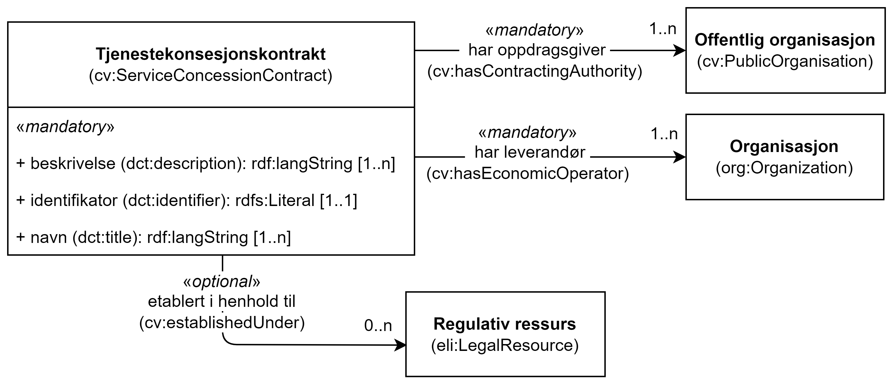

== Klassen Konsesjonskontrakt (cv:ServiceConcessionContract) [[Tjenestekonsesjonskontrakt]]

[[img-KlassenKonsesjonskontrakt]]
.Klassen Tjenestekonsesjonskontrakt (cv:ServiceConcessionContrac)
[link=images/KlassenTjenestekonsesjonskontrakt.png]

[cols="30s,70d"]
|===
|English name|  Concession contract
|Anvendelse| Klassen brukes til å representere en tjenstekonsesjonskontrakt.
|Usage note|This class represents a service concession contact.

Concessions are contracts for pecuniary interest by means of which one or more contracting authorities or contracting entities entrusts the execution of works, or the provision and the management of services, to one or more economic operators.

The object of such contracts is the procurement of works or services by means of a concession, the consideration of which consists in the right to exploit the works or services or in that right together with payment. Such contracts may, but do not necessarily, involve a transfer of ownership to contracting authorities or contracting entities, but contracting authorities or contracting entities always obtain the benefits of the works or services in question. The definition comes from the Directive https://eur-lex.europa.eu/legal-content/EN/TXT/HTML/?uri=CELEX:32014L0023&from=EN[2014/23/EU].
|URI| cv:ServiceConcessionContract
|Kravnivå| Valgfri/Optional
|===

=== Obligatoriske egenskaper for klassen _Konsesjonskontrakt_ [[Konsesjonskontrakt-obligatoriske-egenskaper]]

==== Konsesjonskontrakt – beskrivelse (dct:description) [[Konsesjonskontrakt-beskrivelse]]

[cols="30s,70d"]
|===
|English name|description
|URI|dct:description
|Range|rdf:langString
|Anvendelse|Egenskapen brukes til å oppgi en fritekst beskrivelse av konsesjonskontrakten. Egenskap bør gjentas når beskrivelsen er på flere språk.
|Usage note|This property represents a free text description of the Concession Contract, repeated when the description is in parallel languages.
|Multiplisitet|1..n
|Kravnivå|Obligatorisk/Mandatory
|===

==== Konsesjonskontrakt – identifikator (dct:identifier) [[Konsesjonskontrakt-identifikator]]

[cols="30s,70d"]
|===
|English name|identifier
|URI|dct:identifier
|Range|rdfs:Literal
|Anvendelse|Egenskapen brukes til å oppgi identifikatoren til konsesjonskontrakten.
|Usage note|This property represents an Identifier for the Concession Contract.
|Multiplisitet|1..1
|Kravnivå|Obligatorisk/Mandatory
|===

==== Konsesjonskontrakt – har leverandør (cv:hasEconomicOperator) [[Konsesjonskontrakt-harLeverandør]]

[cols="30s,70d"]
|===
|English name|has economic operator
|URI|cv:hasEconomicOperator
|Range|org:Organization
|Anvendelse|Egenskapen brukes til å referere til leverandøren som er ansvarlig for levering og forvaltning av tjenestene.
|Usage note|This property refers to the Economic Operator in charge for the provision and the management of the services.
|Multiplisitet|1..n
|Kravnivå|Obligatorisk/Mandatory
|===

==== Konsesjonskontrakt – har oppdragsgiver (cv:hasContractingAuthority) [[Konsesjonskontrakt-harOppdragsgiver]]

[cols="30s,70d"]
|===
|English name|has contracting authority
|URI|cv:hasContractingAuthority
|Range|cv:PublicOrganisation
|Anvendelse|Egenskapen brukes til å referere til oppdragsgiveren som til syvende og sist er ansvarlig for en tjeneste.
|Usage note|This property refers to the Contracting Authority which is ultimately responsible for a service.
|Multiplisitet|1..n
|Kravnivå|Obligatorisk/Mandatory
|===

==== Konsesjonskontrakt – navn (dct:title) [[Konsesjonskontrakt-navn]]

[cols="30s,70d"]
|===
|English name|name
|URI|dct:title
|Range|rdf:langString
|Anvendelse|Egenskapen brukes til å oppgi navnet til kontrakten. Egenskapen bør gjentas når navnet er på flere språk.
|Usage note|This property represents the name of the contract, repeated when the name is in parallel languages.
|Multiplisitet|1..n
|Kravnivå|Obligatorisk/Mandatory
|===

=== Valgfrie egenskaper for klassen _Konsesjonskontrakt_ [[Konsesjonskontrakt-valgfrie-egenskaper]]

==== Konsesjonskontrakt – etablert i henhold til (cv:establishedUnder) [[Konsesjonskontrakt-erEtablertIHT]]

[cols="30s,70d"]
|===
|English name|established under
|URI|cv:establishedUnder
|Range|eli:LegalResource
|Anvendelse| Egenskapen brukes til å referere til relevant lovgivning eller policydokumenter (regulativ ressurs) som kontrakten er etablert under.
|Usage note|This property refers to relevant legislation or policy documents i.e. the Legal Resource under which the Concession Contracts are being defined.
|Multiplisitet|0..n
|Kravnivå|Valgfri/Optional
|===
