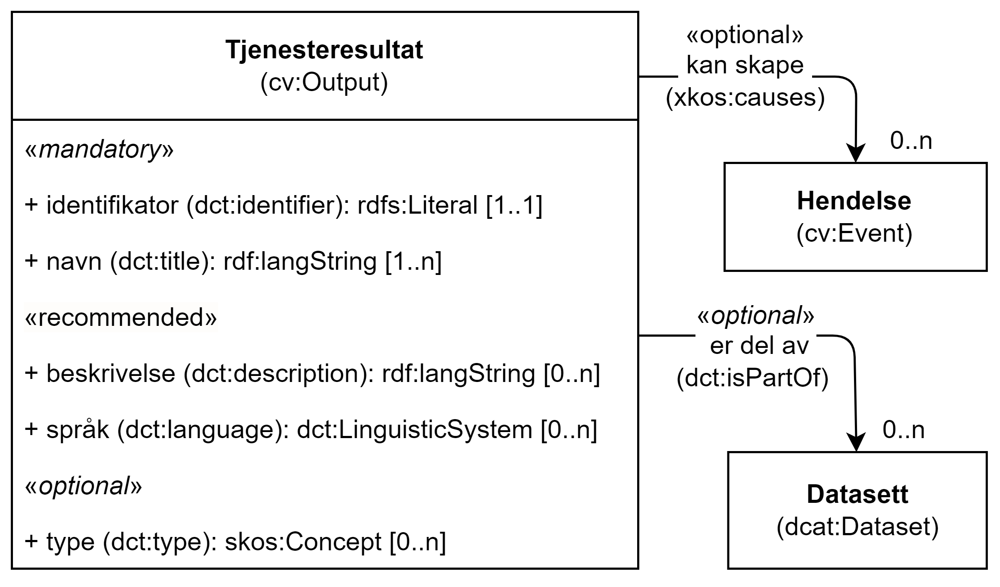

== Klassen Tjenesteresultat (cv:Output) [[Tjenesteresultat]]

[[img-KlassenTjenesteresultat]]
.Klassen Tjenesteresultat (cv:Output)
[link=images/KlassenTjenesteresultat.png]

[cols="30s,70d"]
|===
|English name|Output
|Anvendelse| Klassen brukes til å representere resultat fra en tjeneste.
|Usage note| Outputs can be any resource - document, artefact – anything produced by the Service. In the context of a Public Service, the output provides an official document or other artefact of the Competent Authority (Public Organization) that permits/authorises/entitles an Agent to (do) something.
|URI|cv:Output
|Kravnivå |Anbefalt/Recommended
|Merknad 1|I samsvar med https://data.norge.no/specification/dcat-ap-no/#OffentligTjeneste-produserer[DCAT-AP-NO], kan datasett (`dcat:Dataset`) være en type `cv:Output`. På denne måten kan tjenesteresultatet være et datasett som kan deles, f.eks. selve «bevillingen» som et datasett
|Merknad 2|Norsk utvidelse: Kravnivå  endret fra valgfri til anbefalt, fordi en tjeneste bør ha et resultat tilknyttet.
|Eksempel|Resultater fra tjenesten «Skjenkebevilling (i Brønnøy kommune)» kan være selve bevillingen (når søknaden godkjennes) eller avslag (når søknaden ikke blir godkjent).
|===

=== Obligatoriske egenskaper for klassen _Tjenesteresultat_ [[Tjenesteresultat-obligatoriske-egenskaper]]

==== Tjenesteresultat – identifikator (dct:identifier) [[Tjenesteresultat-identifikator]]

[cols="30s,70d"]
|===
|English name|identifier
|URI|dct:identifier
|Range|rdfs:Literal
|Anvendelse| Egenskapen brukes til å oppgi identifikatoren til tjenesteresultatet.
|Usage note| This property represents an Identifier for the Output.
|Multiplisitet|1..1
|Kravnivå |Obligatorisk/Mandatory
|Merknad|Identifikator er som regel systemgenerert av verktøystøtte, slik at du som vanlig bruker ikke trenger å fylle ut verdien til denne egenskapen manuelt.

For deg som skal utvikle/tilpasse verktøystøtte, se https://data.norge.no/guide/veileder-beskrivelse-av-datasett/#om-identifikator[Om identifikator (dct:identifier) i Veileder for beskrivelse av datasett osv.]
|Eksempel|
|===

==== Tjenesteresultat – tittel (dct:title) [[Tjenesteresultat-tittel]]

[cols="30s,70d"]
|===
|English name|name
|URI|dct:title
|Range| rdf:langString
|Anvendelse| Egenskapen brukes til å oppgi tittel/navn til tjenesteresultatet.
|Usage note| This property represents the official Name of the Output.
|Multiplisitet|1..n
|Kravnivå |Obligatorisk/Mandatory
|Merknad|Norsk utvidelse: Multiplisitet endret fra 1..1 til 1..n, for å støtte flerspråklighet.
|Eksempel|«Skjenkebevilling til «Den beste restauranten AS»»
|===

Eksempel i RDF Turtle:
-----
<bevilling1001> a cv:Output , a dcat:Dataset ;
   dct:title "Skjenkebevilling til «Den beste restauranten AS»"@nb ; .
-----

=== Anbefalte egenskaper for klassen _Tjenesteresultat_ [[Tjenesteresultat-anbefalte-egenskaper]]

==== Tjenesteresultat – beskrivelse (dct:description) [[Tjenesteresultat-beskrivelse]]

[cols="30s,70d"]
|===
|English name|description
|URI|dct:description
|Range| rdf:langString
|Anvendelse| Egenskapen brukes til å oppgi en tekstlig beskrivelse av tjenesteresultatet.
|Usage note| This property represents a free text Description of the Output.
|Multiplisitet|0..n
|Kravnivå |Anbefalt/Recommended
|Merknad|Norsk utvidelse: Multiplisitet endret fra 0..1 til 0..n for å støtte flerspråklighet.
|Eksempel|
|===

Eksempel i RDF Turtle:
-----
<bevilling1001> a cv:Output , a dcat:Dataset ;
   dct:title "Skjenkebevilling til «Den beste restauranten AS», for servering av alkoholholdig drikk i gruppe 3"@nb ; .
-----

==== Tjenesteresultat – språk (dct:language) [[Tjenesteresultat-språk]]

[cols="30s,70d"]
|===
|English name|language
|URI|dct:language
|Range|dct:LinguisticSystem
|Anvendelse| Egenskapen brukes til å oppgi språk som tjenesteresultatet er i.
|Usage note| This property represents the language that the output is in.
|Multiplisitet|0..n
|Kravnivå |Anbefalt/Recommende
|Merknad 1 |Verdien skal velges fra EUs kontrollerte vokabular https://op.europa.eu/en/web/eu-vocabularies/concept-scheme/-/resource?uri=http://publications.europa.eu/resource/authority/language[Språk].
|Remark 1 | The value shall be chosen from Eu's controlled vocabulary https://op.europa.eu/en/web/eu-vocabularies/concept-scheme/-/resource?uri=http://publications.europa.eu/resource/authority/language[Language].
|Merknad 2 |Norsk utvidelse: Ikke eksplisitt med i CPSV-AP.
|Remark 2 | Norwegian extension: Not explicitly specified in CPSV-AP.
|Eksempel|Norsk bokmål
|===

Eksempel i RDF Turtle:
-----
<bevilling1001> a cv:Output , a dcat:Dataset ;
   dct:title "Skjenkebevilling til «Den beste restauranten AS», for servering av alkoholholdig drikk i gruppe 3"@nb ;
   dct:language <http://publications.europa.eu/resource/authority/language/NOB> ; .
-----

=== Valgfrie egenskaper for klassen _Tjenesteresultat_ [[Tjenesteresultat-valgfrie-egenskaper]]

[[Tjenesteresultat-kanSkape]]
==== Tjenesteresultat – kan skape (xkos:causes) 

[cols="30s,70d"]
|===
|English name |may cause
|URI |xkos:causes
|Range |cv:Event
|Anvendelse | Egenskapen brukes til å uttrykke relasjon mellom et tjenesteresultat og en eller flere hendelser, f.eks. endring av data (som et tjenesteresultat) skaper en eller flere hendelser.
|Usage note | This property expresses the relation between an Output and one or more Events, for instance the cases where change of data (as an Output) causes one of more Events.
|Multiplisitet |0..n 
|Kravnivå  |Valgfri/Optional 
|Merknad |Norsk utvidelse: Finnes ikke i CPSV-AP. Det er behov for å tydeliggjøre kopling mellom et tjenesteresultat (f.eks. endring i et datasett) og hendelsen(e) som skapes av endringen.
|Eksempel | 
|===

==== Tjenesteresultat – type (dct:type) [[Tjenesteresultat-type]]

[cols="30s,70d"]
|===
|English name|type
|URI|dct:type
|Range|skos:Concept
|Anvendelse| Egenskapen brukes til å referere til begrep som representerer type(r) tjenesteresultat tilhører.
|Usage note| This property represents the type of Output as defined in a controlled vocabulary.
|Multiplisitet|0..n
|Kravnivå |Valgfri/Optional
|Merknad|Verdien skal velges fra det felles kontrollerte vokabularet https://data.norge.no/vocabulary/service-output-type[Tjenesteresultattype], når verdien finnes i vokabularet.
|Remark |The value shall be chosen from the common controlled vocabulary https://data.norge.no/vocabulary/service-output-type[Service output type], when the value is in the vocabulary.
|Eksempel|tillatelse
|===

Eksempel i RDF Turtle:
-----
<bevilling1001> a cv:Output , a dcat:Dataset ;
   dct:title "Skjenkebevilling til «Den beste restauranten AS», for servering av alkoholholdig drikk i gruppe 3"@nb ;
   dct:type <https://data.norge.no/vocabulary/service-output-type#permit> ; # tillatelse
   .
-----
