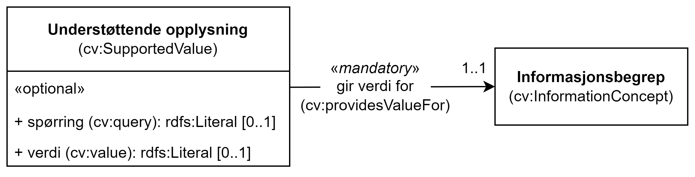

== Klassen Understøttende opplysning (cv:SupportedValue) [[UnderstøttendeOpplysning]]

[[img-KlassenUnderstøttendeOpplysning]]
.Klassen Understøttende opplysning (cv:SupportedValue)
[link=images/KlassenUnderstøttendeOpplysning.png]

[cols="30s,70d"]
|===
|English name| Supported value
|Anvendelse| Klassen brukes til å representere verdien til et informasjonsbegrep som en dokumentasjon oppgir.
|Usage note| This class represents the Value for an Information Concept that is provided by an Evidence.
|URI| cv:SupportedValue
|Kravnivå| Valgfri/Optional
|Merknad| Norsk utvidelse: Ikke eksplisitt spesifisert i CPSV-AP, men i CCCEV som CPSV-AP også bruker.
|Remark | Norwegian extension: Not explicitly specified in CPSV-AP, but in CCCEV which CPSV-AP also uses.
|===

=== Obligatoriske egenskaper for klassen _Understøttende opplysning_ [[UnderstøttendeOpplysning-obligatoriske-egenskaper]]

==== Understøttende opplysning – gir verdi for (cv:providesValueFor) [[UnderstøttendeOpplysning-girVerdiFor]]

[cols="30s,70d"]
|===
|English name|provides value for
|URI|cv:providesValueFor
|Range|cv:InformationConcept
|Anvendelse|Egenskapen brukes til å referere til informasjonsbegrepet som det gis verdi for.
|Usage note|This property represents Information Concept for which the Supported Value provides a value.
|Multiplisitet|1..1
|Kravnivå|Obligatorisk/ Mandatory
|Merknad| Norsk utvidelse: Ikke eksplisitt spesifisert i CPSV-AP, men i CCCEV som CPSV-AP også bruker.
|Remark | Norwegian extension: Not explicitly specified in CPSV-AP, but in CCCEV which CPSV-AP also uses.
|===

=== Valgfrie egenskaper for klassen _Understøttende opplysning_ [[UnderstøttendeOpplysning-valgfrie-egenskaper]]

==== Understøttende opplysning – spørring (cv:query) [[UnderstøttendeOpplysning-spørring]]

[cols="30s,70d"]
|===
|English name|query
|URI|cv:query
|Range|rdfs:Literal
|Anvendelse|Egenskapen brukes til å representere en spørring  som gjør at verdien for informasjonsbegrepet kan hentes fra dokumentasjonsdataene.
|Usage note|This property represents search statement that allows the value for the Information Concept to be retrieved from the Evidence data.
|Multiplisitet| 0..1
|Kravnivå|Valgfri/Optional
|Merknad| Norsk utvidelse: Ikke eksplisitt spesifisert i CPSV-AP, men i CCCEV som CPSV-AP også bruker.
|Remark | Norwegian extension: Not explicitly specified in CPSV-AP, but in CCCEV which CPSV-AP also uses.
|===

==== Understøttende opplysning – verdi (cv:value) [[UnderstøttendeOpplysning-verdi]]

[cols="30s,70d"]
|===
|English name|value
|URI|cv:value
|Range|rdfs:Literal
|Anvendelse|Egenskapen brukes til å representere verdien til et informasjonsbegrep som støttes av dokumentasjonen.
|Usage note|This property represents the Value for the Information Concept that the Evidence supports.
|Multiplisitet| 0..1
|Kravnivå|Valgfri/Optional
|Merknad| Norsk utvidelse: Ikke eksplisitt spesifisert i CPSV-AP, men i CCCEV som CPSV-AP også bruker.
|Remark | Norwegian extension: Not explicitly specified in CPSV-AP, but in CCCEV which CPSV-AP also uses.
|===
