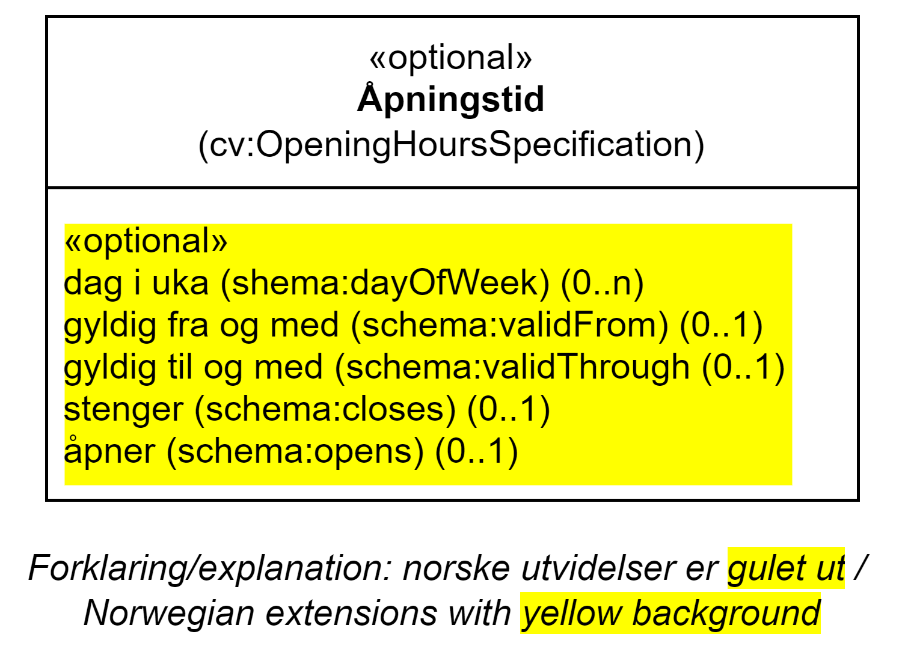

== Klassen Åpningstid (cv:OpeningHoursSpecification) [[Åpningstid]]

[[img-KlassenÅpningstid]]
.Klassen Åpningstid (cv:OpeningHoursSpecificatinon)
[link=images/KlassenÅpningstid.png]

[cols="30s,70d"]
|===
|English name|Opening Hours Specification
|Anvendelse| Klassen brukes til å beskrive detaljer om åpningstid på en strukturert måte.
|Usage note| This class represents a structured value providing information about the opening hours.
|URI| cv:OpeningHoursSpecification
|Kravnivå |Valgfri/Optional
|===

=== Valgfrie egenskaper for Klassen _Åpningstid_ [[Åpningstid-valgfrie-egenskaper]]

==== Åpningstid – dager i uka (schema:dayOfWeek) [[Åpningstid-dagerIUka]]

[cols="30s,70d"]
|===
|English name|day of week
|URI|schema:dayOfWeek
|Range|schema:DayOfWeek
|Anvendelse| Egenskapen brukes til å oppgi dag i uke som åpningen gjelder for.
|Usage note| This property represents the day of the week for which these opening hours are valid
|Multiplisitet|0..n
|Kravnivå |Valgfri/Optional
|Merknad | Norsk utvidelse: Ikke eksplisitt spesifisert i CPSV-AP.
|Remark | Norwegian extension: Not explicitly specified in  CPSV-AP.
|Eksempel|Mandag til fredag.
|===

Eksempel i RDF Turtle:
-----
<åpningsTid> a cv:OpeningHoursSpecification ;
   schema:dayOfWeek schema:Monday , schema:Tuesday , schema:Wednesday , schema:Tursday , schema:Friday ;
   schema:opens "08:00"^^xsd:time ;
   schema:closes "16:00"^^xsd:time ; .
-----

==== Åpningstid – gyldig fra og med (schema:validFrom) [[Åpningstid-gyldigFraOgMed]]

[cols="30s,70d"]
|===
|English name|valid from inclusive
|URI|schema:validFrom
|Range| xsd:date or xsd:dateTime
|Anvendelse| Egenskapen brukes til å oppgi fra og med når åpningstiden gjelder.
|Usage note| This property represents the date when the open hours specification becomes valid.
|Multiplisitet|0..1
|Kravnivå |Valgfri/Optional
|Merknad | Norsk utvidelse: Ikke eksplisitt spesifisert i CPSV-AP.
|Remark | Norwegian extension: Not explicitly specified in  CPSV-AP.
|Eksempel|Gyldighet til julestengning.
|===

Eksempel i RDF Turtle:
-----
<ChristmasClosed> a cv:OpeningHoursSpecification;
   schema:validFrom "2016-12-24T012:00Z"^^xsd:dateTime ;
   schema:validThrough "2017-01-02T09:00Z"^^xsd:dateTime .
-----

==== Åpningstid – gyldig til og med (schema:validThrough) [[Åpningstid-gyldigTilOgMed]]

[cols="30s,70d"]
|===
|English name|valid through inclusive
|URI|schema:validThrough
|Range| xsd:date or xsd:dateTime
|Anvendelse| Egenskapen brukes til å oppgi til og med når åpningstiden gjelder.
|Usage note| This property represents the date after which when the open hours specification is not valid.
|Multiplisitet|0..1
|Kravnivå |Valgfri/Optional
|Merknad | Norsk utvidelse: Ikke eksplisitt spesifisert i CPSV-AP.
|Remark | Norwegian extension: Not explicitly specified in  CPSV-AP.
|Eksempel|Se under <<Åpningstid-gyldigFraOgMed>>.
|===

Eksempel i RDF Turtle: Se under <<Åpningstid-gyldigFraOgMed>>.

==== Åpningstid – stenger (schema:closes) [[Åpningstid-stenger]]

[cols="30s,70d"]
|===
|English name|closes
|URI|schema:closes
|Range| xsd:time
|Anvendelse| Egenskapen brukes til å oppgi tidspunktet for stengning.
|Usage note| This property represents the closing hour.
|Multiplisitet|0..1
|Kravnivå |Valgfri/Optional
|Merknad | Norsk utvidelse: Ikke eksplisitt spesifisert i CPSV-AP.
|Remark | Norwegian extension: Not explicitly specified in CPSP-AP.
|Eksempel|Se under <<Åpningstid-dagerIUka>>.
|===

Eksempel i RDF Turtle: Se under <<Åpningstid-dagerIUka>>.

==== Åpningstid – åpner (schema:opens) [[Åpningstid-åpner]]

[cols="30s,70d"]
|===
|English name|opens
|URI|schema:opens
|Range| xsd:time
|Anvendelse| Egenskapen brukes til å oppgi tidspunktet for åpning.
|Usage note| This property represents the opening hour.
|Multiplisitet|0..1
|Kravnivå |Valgfri/Optional
|Merknad 1 |I henhold til https://schema.org/OpeningHoursSpecification[schema.org  &#x29C9;, window="_blank", role="ext-link"] er det «åpent» hvis egenskapen brukes og «lukket» ellers.
|Remark 1 |According to https://schema.org/OpeningHoursSpecification[schema.org  &#x29C9;, window="_blank", role="ext-link"], “The place is *open* if the https://schema.org/opens[opens &#x29C9;, window="_blank", role="ext-link"] property is specified, and *closed* otherwise.”
|Merknad 2 | Norsk utvidelse: Ikke eksplisitt spesifisert i CPSV-AP.
|Remark 2 | Norwegian extension: Not explicitly specified in CPSP-AP.
|Eksempel|Se under <<Åpningstid-dagerIUka>>.
|===

Eksempel i RDF Turtle: Se under <<Åpningstid-dagerIUka>>.
