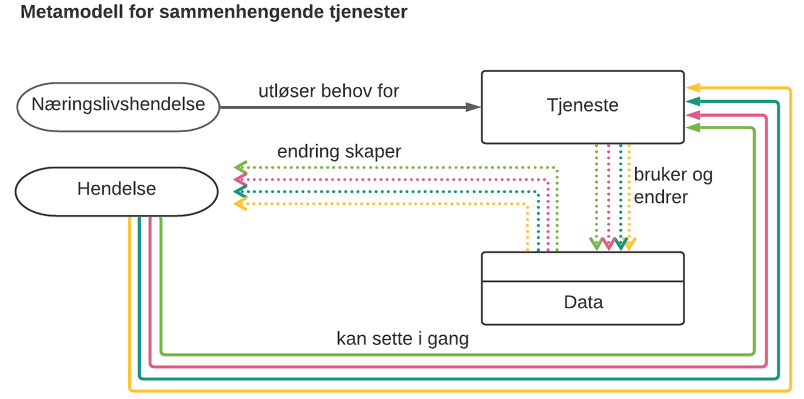

== Om spesifikasjonen [[OmSpesifikasjonen]]

=== Formål [[Formål]]

:xrefstyle: full

Formålet med spesifikasjonen er å legge til rette for en felles måte å beskrive tjenester og hendelser og en felles måte å utveksle beskrivelsene. Spesifikasjonen skal bidra til å sikre interoperabilitet av kataloger/beskrivelser av tjenester og hendelser, på tvers av sektorer. Spesifikasjonen muliggjør også maskinell tilgang til beskrivelser av tjenester og hendelser.

I tillegg til beskrivelser av (metadata om) hendelser og tjenester, støtter CPSV-AP-NO også utveksling av data i forbindelse med utførelsen (_"execution"_) av en gitt tjeneste, ved at <<Dokumentasjon, «dokumentasjon»>> er ment å være et konkret stykke dokumentasjon som brukeren av en tjeneste oppgir, og <<Tjenesteresultat, «tjenesteresultat»>> er ment å være et konkret stykke tjenesteresultat som en tjeneste produserer. 

Spesifikasjonen inngår i https://www.digdir.no/3626[Rammeverk for informasjonsforvaltning &#x29C9;, window="_blank", role="ext-link"].

:xrefstyle: short

Spesifikasjonen støtter også metamodell for sammenhengende tjenester illustrert i <> som er hentet fra Digitaliseringsbloggen https://www.digdir.no/sammenhengende-tjenester/vi-ma-snakke-det-samme-spraket-i-sammenhengende-tjenester/2614[Vi må snakke det samme språket i sammenhengende tjenester! &#x29C9;, window="_blank", role="ext-link"]. Figuren viser sammenheng mellom hendelse, tjeneste og data: En hendelse kan utløse behov for en eller flere tjenester. En tjeneste bruker data og kan også  resultere i endringer i data. Endring i data kan føre til en eller flere nye hendelser som igjen kan utløse behov for en eller flere tjenester.

[[img-HendelseTjenesteData]]
.Sammenheng mellom hendelse, tjeneste og data.
[link=images/FigurHendelseTjenesteData.png]

:xrefstyle: full

=== Omfang og avgrensing [[Omfang-og-avgrensing]]

Spesifikasjonen er anbefalt brukt til å beskrive tjenester og hendelser samt å utveksle/tilgjengeliggjøre beskrivelsene. I konteksten av denne spesifikasjonen, er en hendelse en endring hos en aktør som kan utløse behov for en eller flere tjenester, dvs. ikke en hvilken som helst hendelse.

Spesifikasjonen er basert EUs https://semiceu.github.io/CPSV-AP/releases/3.2.0/[CPSV-AP v.3.2 &#x29C9;, window="_blank", role="ext-link"] (__Core Public Service Vocabulary Application Profile__), supplert med EUs https://semiceu.github.io/CCCEV/releases/2.1.0/[CCCEV v.2.1 &#x29C9;, window="_blank", role="ext-link"] (__Core Criterion and Core Evidence Vocabulary__). I tillegg til beskrivelser av offentlige tjenester som CPSV-AP dekker, dekker spesifikasjonen også behovet for å beskrive tjenester som ikke er offentlige tjenester, men som f.eks. er involvert i sammenhengende tjenester fra det offentlige.

Spesifikasjonen inneholder også engelske navn (_English name_) og beskrivelser (_Usage note_). Det gjøres oppmerksom på at ikke alle engelske navn eller beskrivelser er ordrette sitater fra EUs originale engelske tekster. Vi kan ha valgt en annen tekst til å formidle det samme budskapet på, med mindre vi eksplisitt sier at det er et avvik (dvs. også i meningsinnholdet).

Ettersom spesifikasjonen er basert på https://www.w3.org/RDF/[Resource Desciption Framework (RDF). &#x29C9;, window="_blank", role="ext-link"], vil beskrivelsene i henhold til spesifikasjonen også være RDF-baserte og dermed maskinprosesserbare. Som støtte til teknisk implementering er det i spesifikasjonen også tatt med en del eksempler i RDF Turtle. Eksemplene i RDF Turtle er kun veiledende, de er ikke komplette og kan også mangle verdier til obligatoriske egenskaper.

=== Målgrupper [[Målgrupper]]

Spesifikasjonen har ikke sluttbrukere av tjenester som sin målgruppe, men

* deg som skal beskrive
** din virksomhets tjenester overfor innbyggere, næringsliv og sivilsamfunnet ellers
** hendelser som kan utløse behov for din eller andre virksomheters tjenester
** sammenhengende tjenester (kjeder av tjenester som eies av flere virksomheter)
** hendelser (f.eks. livshendelser) som kan utløse behov for tjenester fra flere virksomheter
* deg som søker etter og ønsker å gjenbruke / sette sammen tjenester fra andre virksomheter
* deg som skal utvikle/tilpasse verktøystøtte for ovennevnte beskrivelser og/eller for tilgjengeliggjøring/utveksling av beskrivelsene

<<Forenklet-fremstilling>> er primært ment for den ikke-tekniske målgruppen, <<Spesifikasjon-per-klasse>> for den tekniske målgruppen, <<Spesielle-temaer>> for begge målgrupper og fortrinnsvis sammen. 

=== Forvaltningsregime [[Forvaltningsregime]]

Spesifikasjonen forvaltes av https://digdir.no[Digitaliseringsdirektoratet (Digdir) &#x29C9;, window="_blank", role="ext-link"].

Utarbeidelse av nye versjoner av spesifikasjonen initieres av Digdir. Mindre endringer håndteres av Digdir. Ved behov for større endringer vil Digdir sette sammen arbeidsgruppe med representanter fra relevante virksomheter, for utarbeidelse av forslag til den reviderte versjonen som sendes ut til bred kommentering før fastsetting.

=== Om kravnivåene i spesifikasjonen [[Om-kravene]]

Spesifikasjonen bruker ordene «obligatorisk» ("_mandatory_"), «anbefalt» ("_recommended_") og «valgfri» ("_optional_"). Disse er https://data.norge.no/specification/dcat-ap-no/#Om-kravene[forklart i DCAT-AP-NO &#x29C9;, window="_blank", role="ext-link"], og forklaringene gjentas ikke her.

// include::Leseveiledning.adoc[]
