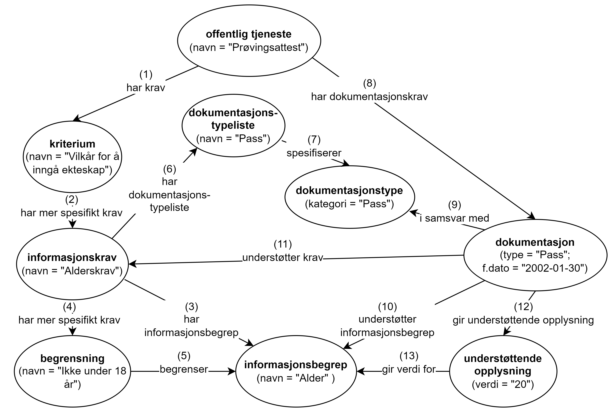
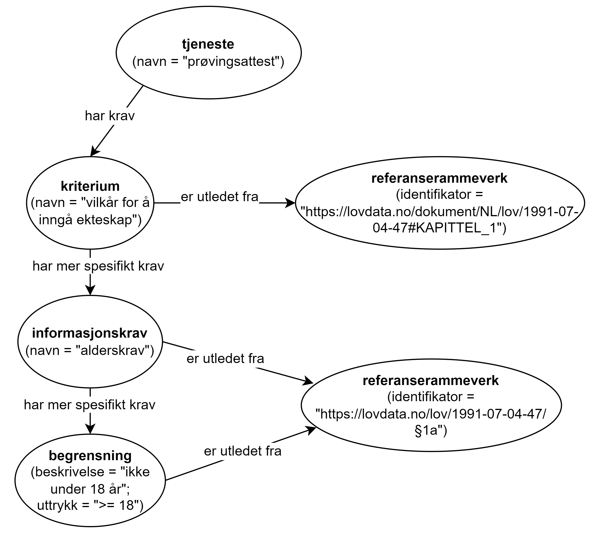

=== Å beskrive dokumentasjonskrav [[Å-beskrive-dokumentasjonskrav]]

Spesifikasjonen gjør det mulig å beskrive et dokumentasjonskrav strukturert og dermed også maskinprosesserbart.

[[img-FigurEksempelDokumentasjonskrav]]
.Eksempel - beskrivelse av «alderskrav» til tjenesten «prøvingsattest»
[link=images/FigurEksempelDokumentasjonskrav.png]

<> Viser et eksempel på å beskrive et av kravene som skal oppfylles for å kunne utføre tjenesten https://www.skatteetaten.no/skjema/provingsattest/[«prøvingsattest» &#x29C9;, window="_blank", role="ext-link"] som Skatteetaten tilbyr.

<> forklares som følger (numrene refererer til de samme numrene i figuren):

.  Tjenesten «prøvingsattest» har «vilkår for å inngå ekteskap» som krav
. «Vilkår for å inngå ekteskap» har et mer spesifikt informasjonskrav «alderskrav»
. «Alderskrav» refererer til informasjonsbegrepet «alder»
. «Alderskrav» har også en mer spesifikk begrensning «ikke under 18 år»
. Begrensningen «ikke under 18 år» begrenser informasjonsbegrepet «alder»
. «Alderskrav» bruker en liste over lovlige dokumentasjonstyper
. På dokumentasjonstypelisten finner man «pass»
. Tjenesten «prøvingsattest» bruker i dette konkrete eksemplet brukerens «pass» som dokumentasjon
. «Pass» er i samsvar med det som er spesifisert som lovlig dokumentasjonstype
. «Pass» understøtter informasjonsbegrep «alder» (fordi pass inneholder fødselsdato)
. «Pass» understøtter informasjonskrav «alderskrav» (fordi pass inneholder fødselsdato)
. Fødselsdatoen i dette konkrete eksemplet er `2002-01-30` og gir understøttende opplysning `20` (som alder)
. `20` er verdien for informasjonsbegrepet «alder», som altså er over 18, og «alderskrav» er dermed oppfylt.

Som illustrert i <>, er det også mulig å knytte kravene illustrert i eksemplet ovenfor, til aktuell lovgivning: «vilkår for å inngå ekteskap» er utledet fra kapittel 1 i ekteskapsloven, og «alderskrav» og begrensningen «ikke under 18 år» er utledet fra §1a i ekteskapsloven.

[[img-FigurEksempelDokumentasjonskrav2]]
.Eksempel på å knytte dokumentasjonskrav til lovgivning
[link=images/FigurEksempelDokumentasjonskrav2.png]

Eksemplet i RDF Turtle:
-----
<prøvingsattest> a cpsv:PublicService ;
   dct:title "Prøvingsattest"@nb ; # navn
   cv:holdsRequirement <vilkårForÅInngåEkteskap> ; # har krav
   cv:hasInput <eksempelPass> ; # har dokumentasjonskrav
   .

<vilkårForÅInngåEkteskap> a cv:Criterion ;
   dct:title "Vilkår for å inngå ekteskap"@nb ; # navn
   cv:isDerivedFrom [ a cv:ReferenceFramework ; # er utledet fra
      dct:identifier <https://lovdata.no/dokument/NL/lov/1991-07-04-47#KAPITTEL_1> ; ] ;
   cv:hasRequirement <alderskrav> ; # har mer spesifikt krav
   .

<alderskrav> a cv:InformationRequirement ;
   dct:title "Alderskrav"@nb ; # navn
   cv:isDerivedFrom [ a cv:ReferenceFramework ; # er utledet fra
      dct:identifier <https://lovdata.no/lov/1991-07-04-47/§1a> ; ] ;
   cv:hasRequirement <ikkeUnder18> ; # har mer spesifikt krav
   cv:hasEvidenceTypeList <typeListePass> ; # har dokumentasjonstypeliste
   .

<ikkeUnder18> a cv:Constraint ;
   dct:title "Ikke under 18 år" ; # navn
   cv:isDerivedFrom [ a cv:ReferenceFramework ; # er utledet fra
      dct:identifier <https://lovdata.no/lov/1991-07-04-47/§1a> ; ] ;
   cv:constrains <alder> ; # begrenser
   .

<alder> a cv:InformationConcept ;
   dct:title "Alder"@nb ; # navn
   .

<typeListePass> a cv:EvidenceTypeList ;
   skos:prefLabel "pass"@nb ;
   cv:specifiesEvidenceType <typePass> ; #spesifiserer
   .

<typePass> a cv:EvidenceType ;
   cv:evidenceTypeClassification <pass> ; # dokumentasjonstypekategori
   .

<pass> a skos:Concept ;
   skos:prefLabel "pass"@nb ; # navn
   .

<eksempelPass> a cv:Evidence ;
   dct:title "pass fra brukeren som dokumentasjon"@nb ; # navn
   dct:conformsTo <pass> ; # i samsvar med
   cv:supportsConcept <alder> ; # understøtter informasjonsbegrep
   cv:supportsRequirement <alderskrav> ; # understøtter krav
   cv:supportsValue <alderFraPass> ; # gir understøttende opplysning
   .

<alderFraPass> a cv:SupportedValue ;
   cv:providesValueFor <alder> ; # gir verdi for
   cv:value "20"^^xsd:positiveInteger ; # verdi
   .
-----
