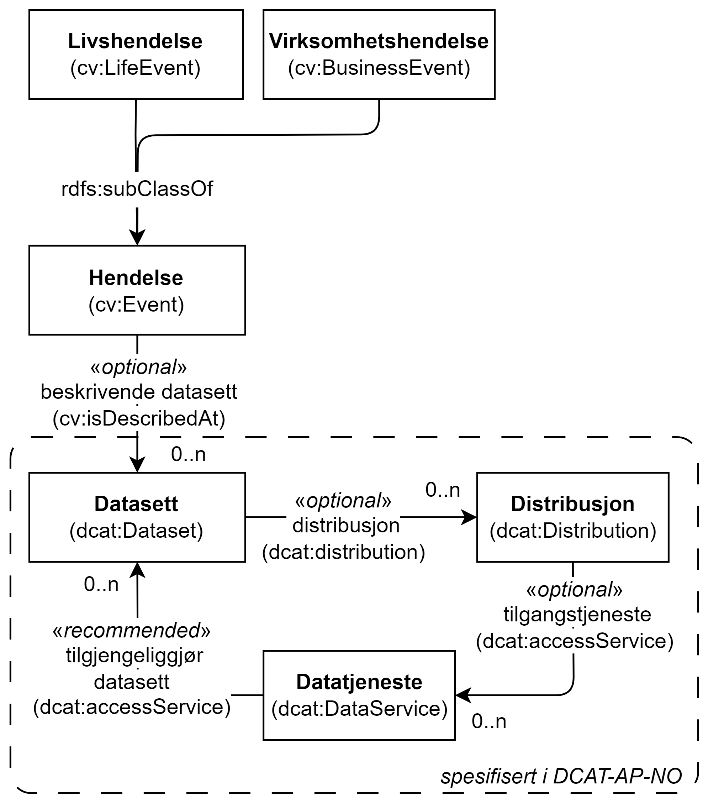

=== Å publisere hendelsesstrøm [[Hendelsesstrøm]]

[[img-HendelseOgDistribusjon]]
.Hendelse og Distribusjon
[link=images/FigurHendelseOgDistribusjon.png]

Som illustrert i <> har spesifikasjonen utvidet CPSV-AP med egenskapen «distribusjon» (`dcat:distribution`) i <<Hendelse>>, <<Livshendelse>> og <<Virksomhetshendelse>>, og dermed også implisitt sagt at (beskrivelse av) en Hendelse er et Datasett. Egenskapen brukes til å referere til konkrete distribusjoner av f.eks. en hendelsesstrøm.

Se ellers https://data.norge.no/guide/veileder-beskrivelse-av-datasett/#sammenheng["Sammenheng mellom datasett, distribusjon, datatjeneste, begrep og informasjonsmodell i Veileder for beskrivelse av datasett osv. &#x29C9;", window="_blank", role="ext-link"], for hvordan et datasett (som i dette tilfellet er en hendelsesbeskrivelse) kan knyttes til distribusjon og datatjeneste (også kalt API).
