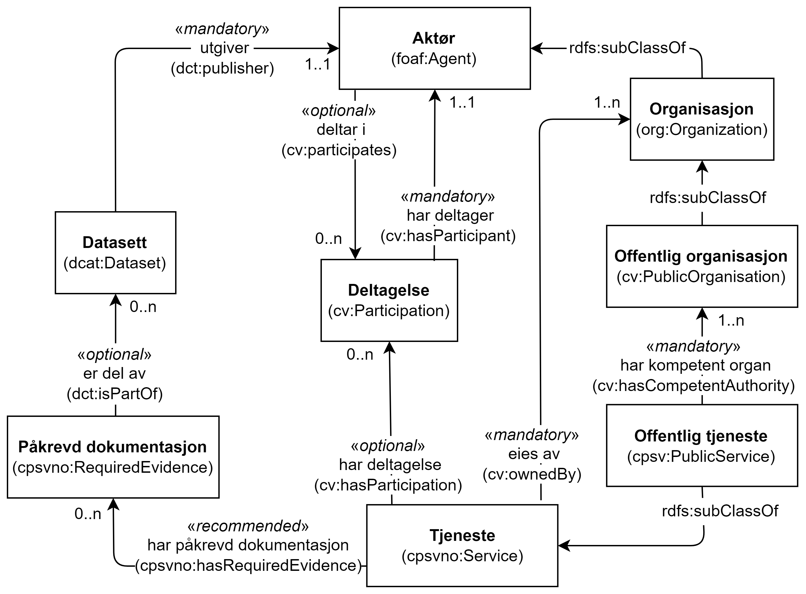

=== Å knytte deltagende aktører til en tjeneste [[KnytteDeltagendeAktørerTilEnTjeneste]]

[[img-FigurTjenesteOgDeltagelse]]
.Tjeneste og Deltagelse
[link=images/FigurTjenesteOgDeltagelse.png]

Som illustrert i <> brukes egenskapen <<Tjeneste-eiesAv>> til å uttrykke relasjonen mellom en Tjeneste (`cpsvno:Service`) og dens eier (en Aktør, `foaf:Agent`), og egenskapen <<OffentligTjeneste-harKompetentOrgan>> til å uttrykke relasjonen mellom en Offentlig tjeneste (`cpsv:PublicService`) og dens kompetente organ (en Offentlig organisasjon, `cv:PublicOrganisation`).

For å uttrykke involvering av andre aktører (inkl. andre offentlige organisasjoner) enn ovennevnte, brukes <<Deltagelse>>. En Tjeneste kan ha en eller flere Deltagelser knyttet til seg, og dette uttrykkes ved bruk av egenskapen <<Tjeneste-har-deltagelse>> (eller egenskapen <<OffentligTjeneste-har-deltagelse>>). En Aktør (inkl. Offentlig organisasjon) kan ha en eller flere roller i en eller flere Deltagelser, og dette uttrykkes ved bruk av egenskapen <<Aktør-harRolle>> (eller <<OffentligOrganisasjon-harRolle>>).

Den obligatoriske egenskapen <<Deltagelse-rolle>> skal brukes til å beskrive en eller flere roller i en Deltagelse, f.eks. «dataleverandør» (leverandør av f.eks. datasett som bekreftelse på at et dokumentasjonsbevis er oppfylt), og «datakonsument» (konsument av datasett som produseres av tjenesten). Slik vi forstår CPSV-AP, ved å knytte en Aktør til en gitt Deltagelse, sier man implisitt at Aktøren har alle rollene i den aktuelle Deltagelse. Det bør derfor lages flere instanser av klassen Deltagelse, f.eks. en med bare rollen «dataleverandør» og en med bare rollen «datakonsument», når ikke alle deltagende aktører har begge roller.

Eksempel: Politidirektoratet (med datasett «Vandelsattest») deltar som dataleverandør til tjenesten «Skjenkebevilling».

Eksempel i RDF Turtle:
----
<skjenkebevilling> a cpsv:PublicService ;
   cv:hasParticipation <deltagendeDataleverandør> ; .

<deltagendeDataleverandør> a cv:Participation ;
   dct:description "deltagende dataleverandører til tjenesten Skjenkebevilling"@nb ;
   cv:role <https://data.norge.no/vocabulary/role-type#data-provider> ; # dataleverandør
   .

<Politidirektoratet> a cv:PublicOrganisation ;
   cv:playsRole <deltagendeDataleverandør> ; .
----
