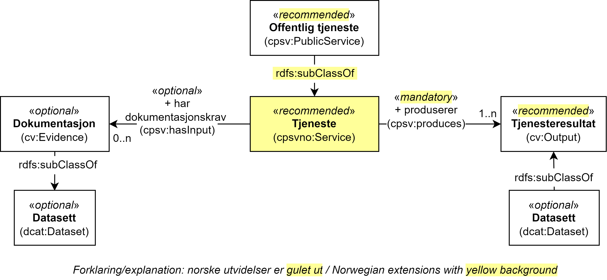

=== Å knytte en (offentlig) tjeneste til et datasett og derfra til API, begrep og informasjonsmodell [[KnytteTilDatasett]]

[[img-TjenesteOgData]]
.Tjeneste med Datasett (dcat:Dataset) som dokumentasjonskrav og tjenesteresultat
[link=images/FigurTjenesteMedDataInnOgUt.png]

Som illustrert i figur <>, kan et Tjenesteresultat (`cv:Output`) produsert av en Tjeneste (`cpsvno:Service` inkl. subklassen Offentlig tjeneste (`cpsv:PublicService`)) være et Datasett (`dcat:Dataset`), f.eks. selve  «bevilling» som et resultat fra tjenesten «Skjenkebevilling» kan deles som et datasett.

Som også illustrert i figuren, kan et dokumentasjonskrav (`cv:Evidence`) også bekreftes ved en dokumentreferanse (`cccev:DocumentReference`) som kan være et datasett (`dcat:Dataset`), f.eks. «Vandelsattest». Ut fra den engelske usage note til <<Dokumentasjon>>, kan dokumentasjon (_evidence_) være en hvilken som helst ressurs som trengs for å utføre en (offentlig) tjeneste, f.eks. et utfylt søknadsskjema.

Se https://data.norge.no/guide/veileder-beskrivelse-av-datasett/#sammenheng[Sammenheng mellom datasett, distribusjon, datatjeneste, begrep og informasjonsmodell i _Veileder for beskrivelse av datasett osv._], for hvordan datasett (som f.eks. «Skjenkebevillingen» og «Vandelsattest») kan videre knyttes til distribusjon, datatjeneste (også kalt API), begrep og informasjonsmodell.
