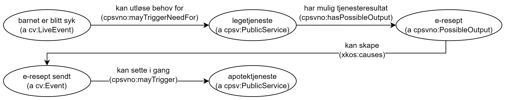

=== Å beskrive en tjenestekjede [[Tjenestekjede]]

Spesifikasjonen har lagt til grunn at en hendelse er en ikke-delbar enhet, basert på bl.a. EUs forklaring på en Virksomhetshendelse (Business event): "Business Event is a specific situation or event in the lifecycle of a business that fulfils one or more needs or (legal) obligations of that business [yellow-background]#at this specific point in time#” (vår egen utheving), dvs. at en hendelse er noe som skjer på et gitt tidspunkt. Spesifikasjonen følger derfor CPSV-AP som ikke har støtte for å uttrykke at en hendelse kan bestå av andre hendelser.

Det er på den annen side mulig å beskrive en https://data.norge.no/concepts/99d36cbe-9368-4ded-b400-efc34eb8917e[tjenestekjede] som dekker en rekke av enkelthendelser, som vist i <>.

[[img-Tjenestekjede]]
.Klasser og egenskaper for beskrivelse av en tjenestekjede
[link=images/FigurTjenestekjede.png]
image::images/FigurTjenestekjede.png[alt="UML-diagram med seks klasser og relasjoner imellom klassene. Norske utvidelser er gulet ut. Innholdet i UML-diagrammet er forklart i teksten."]

<> illustrerer hvordan deler av livshendelsen Alvorlig sykt barn illustrert i <>, beskrives med CPSV-AP-NO.

[[img-FigurSyktBarnBeskrevetMedCPSVNO]]
.Eksempel på bruk av CPSV-AP-NO til å beskrive deler av livshendelsen "Alvorlig sykt barn"
[link=images/FigurSyktBarnBeskrevetMedCPSVNO.png]

Eksempel i RDF Turtle:
-----
<barnetErBlittSyk> a cv:LifeEvent ;
  cpsvno:mayTriggerNeedFor <legetjeneste> .

<legetjeneste> a cpsv:PublicService ;
  cpsv:produces <e-resept> .

<e-resept> a dcat:Dataset ;
  xkos:causes <e-reseptSendt> .

<e-reseptSendt> a cv:Event ;
  cpsvno:mayTriggerNeedFor <apotektjeneste> .

<apotektjeneste> a cpsvno:Service.
-----
