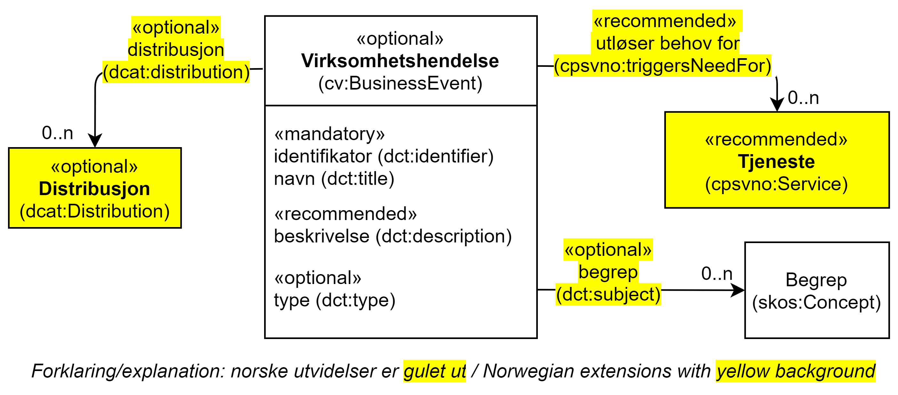

== Klassen Virksomhetshendelse (cv:BusinessEvent) [[Virksomhetshendelse]]

[[img-KlassenVirksomhetshendelse]]
.Klassen Virksomhetshendelse (cv:BusinessEvent).
[link=images/KlassenVirksomhetshendelse.png]

[cols="30s,70d"]
|===
|English name|Business Event
|Beskrivelse|Brukes til å representere en hendelse som er en spesifikk situasjon i livssyklus til en virksomhet og som trigger behov for offentlig tjeneste eller (juridiske) plikter på det spesifikke tidspunkt.
|Usage note|This class represents a Business Event, which specialises Event. A Business Event is a specific situation or event in the lifecycle of a business that fulfils one or more needs or (legal) obligations of that business at this specific point in time.
|URI|cv:BusinessEvent
|Subklasse av / Subclass of|cv:Event
|Kravsnivå|Valgfri/Optional
|Merknad|
|Remarks|A Business Event requires a set of public services to be delivered and consumed in order for the associated business need(s) or obligation(s) to be fulfilled. Business Events are defined within the context of a particular Member State.
|Eksempel|«Å starte og drive en restaurant» er en virksomhetshendelse.
|===

Eksempel i RDF Turtle:
-----
<starteOgDriveRestaurant> a cv:BusinessEvent ; .
-----

=== Obligatoriske egenskaper for klassen Virksomhetshendelse [[Virksomhetshendelse-obligatoriske-egenskaper]]

==== Virksomhetshendelse – identifikator (dct:identifier) [[Virksomhetshendelse-identifikator]]

[cols="30s,70d"]
|===
|English name|identifier
|URI|dct:identifier
|Range|rdfs:Literal typed as xsd:anyURI
|Beskrivelse|Brukes til å oppgi identifikatoren til en hendelse.
|Usage note|This property represents an Identifier for the Event.
|Multiplisitet|1..1
|Kravsnivå|Obligatorisk/Mandatory
|Merknad|Identifikator er som regel systemgenerert av verktøystøtte, slik at du som vanlig bruker ikke trenger å fylle ut verdien til denne egenskapen manuelt.

For deg som skal utvikle/tilpasse verktøystøtte, se https://data.norge.no/guide/veileder-beskrivelse-av-datasett/#om-identifikator[Om identifikator (dct:identifer) i Veileder for beskrivelse av datasett osv.]
|Eksempel|
|===

==== Virksomhetshendelse – navn (dct:title) [[Virksomhetshendelse-navn]]

[cols="30s,70d"]
|===
|English name|name
|URI|dct:title
|Range|rdfs:Literal
|Beskrivelse|Brukes til å oppgi navn til en hendelse. Gjentas når navnet finnes i flere språk.
|Usage note|This property represents the Name (or title) of the Event.
|Multiplisitet|1..n
|Kravsnivå|Obligatorisk/Mandatory
|Merknad|Norsk utvidelse: Multiplisitet endret fra 1..1 til 1..n, for å støtte flerspråklighet.
|Eksempel|Å starte og drive en restaurant
|===

Eksempel i RDF Turtle:
----
<starteOgDriveRestaurant> a cv:BusinessEvent ;
   dct:title "Å starte og drive en restaurant"@nb ; .
----

=== Anbefalte egenskaper for klassen Virksomhetshendelse [[Virksomhetshendelse-anbefalte-egenskaper]]

==== Virksomhetshendelse – beskrivelse (dct:description) [[Virksomhetshendelse-beskrivelse]]

[cols="30s,70d"]
|===
|English name|description
|URI|dct:description
|Range|rdfs:Literal
|Beskrivelse|Brukes til å oppgi en tekstlig beskrivelse av hendelsen. Gjentas når beskrivelsen finnes i flere språk.
|Usage note|This property represents a free text description of the Event. The description is likely to be the text that a business or citizen sees for that specific Event when looking for relevant Public Services. Public administrations are therefore encouraged to include a reasonable level of detail in the description.
|Multiplisitet|0..n
|Kravsnivå|Anbefalt/Recommended
|Merknad1|Norsk utvidelse: Kravsnivå endret fra valgfri til anbefalt, dette fordi enhver hendelse bør beskrives med mindre navnet er selvforklarende.
|Merknad2|Norsk utvidelse: Multiplisitet endret fra 0..1 til 0..n, for å støtte flerspråklighet.
|Eksempel|Elektronisk prosess for etablering og oppstart av en restaurant.
|===

Eksempel i RDF Turtle:
----
<starteOgDriveRestaurant> a cv:BusinessEvent ;
   dct:title "Å starte og drive en restaurant"@nb ;
   dct:description "Elektronisk prosess for å starte og drive en restaurant"@nb ; .
----

==== Virksomhetshendelse – utløser behov for (cpsvno:triggersNeedFor) [[Virksomhetshendelse-utløserBehovFor]]

[cols="30s,70d"]
|===
|English name|related service
|URI|cpsvno:triggersNeedFor
|Range|cpsv:PublicService
|Beskrivelse|Brukes til å referere til tjenester som den aktuelle hendelsen kan utløse behov for.
|Usage note|This property links an event directly to a service that is related to it.
|Multiplisitet|0..n
|Kravsnivå|Anbefalt/Recommended
|Merknad|Norsk utvidelse: Denne finnes ikke i CPSV-AP. Begrunnelse: det er behov for en mer presis URI enn dct:relation som er i CPSV-AP. Inntil vi finner en passende URI i eksisterende vokabularer, bruker vi denne egendefinerte URI.
|Eksempel|Hendelsen «Å starte og drive en restaurant» utløser behov for tjenesten «Søknad om skjenkebevilling».
|===

Eksempel i RDF Turtle:
-----
<starteOgDriveRestaurant> a cv:BusinessEvent ;
   dct:title "Å starte og drive en restaurant"@nb ;
   cpsvno:triggersNeedFor <søknadOmSkjenkebevilling> ; .

<søknadOmSkjenkebevilling> a cv:PublicService ; .
-----

=== Valgfrie egenskaper for klassen Virksomhetshendelse [[Virksomhetshendelse-valgfrie-egenskaper]]

==== Virksomhetshendelse – begrep (dct:subject) [[Virksomhetshendelse-begrep]]

[cols="30s,70d"]
|===
|English name|subject
|URI|dct:subject
|Range|skos:Concept
|Beskrivelse|Brukes til å referere til begrep som er viktig for å forstå hendelsen.
|Usage note|To refer to concept that is important for the understanding of the event.
|Multiplisitet|0..n
|Kravsnivå|Valgfri/Optional
|Merknad|Norsk utvidelse: Denne finnes ikke i CPSV-AP. Begrunnelse: det er behov for å kunne referere til begreper som er viktig for å forstå hendelsen.
|Eksempel|
|===

==== Virksomhetshendelse – distribusjon (dcat:distribution) [[Virksomhetshendelse-distribusjon]]

[cols="30s,70d"]
|===
|English name|distribution
|URI|dcat:distribution
|Range|dcat:Distribution
|Beskrivelse|Brukes til å referere til distribusjon av hendelse som f.eks. kan abonneres på.
|Usage note|To refer to Distribution of the Event.
|Multiplisitet|0..n
|Kravsnivå|Valgfri/Optional
|Merknad|Norsk utvidelse: Denne finnes ikke i CPSV-AP. Begrunnelse: det er behov for å kunne publisere f.eks. hendelsesstrøm som kan abonneres på.
|Eksempel|
|===

==== Virksomhetshendelse – type (dct:type) [[Virksomhetshendelse-type]]

[cols="30s,70d"]
|===
|English name|type
|URI|dct:type
|Range|skos:Concept
|Beskrivelse|Brukes til å oppgi type hendelse.
|Usage note|The type property links an Event to a controlled vocabulary of event types and it is the nature of those controlled vocabularies that is the major difference between a business event, such as creating the business in the first place and a life event, such as the birth of a child.
|Multiplisitet|0..n
|Kravsnivå|Valgfri/Optional
|Merknad|Verdien skal velges fra en felles kontrollert liste over hendelsestyper når den finnes på listen. Se forslag under til et slikt kontrollert vokabular.
|Eksempel|
|===

Forslag til et kontrollert vokabular for typer virksomhetshendelse:

* [yellow-background]#<kom med innspill>#
